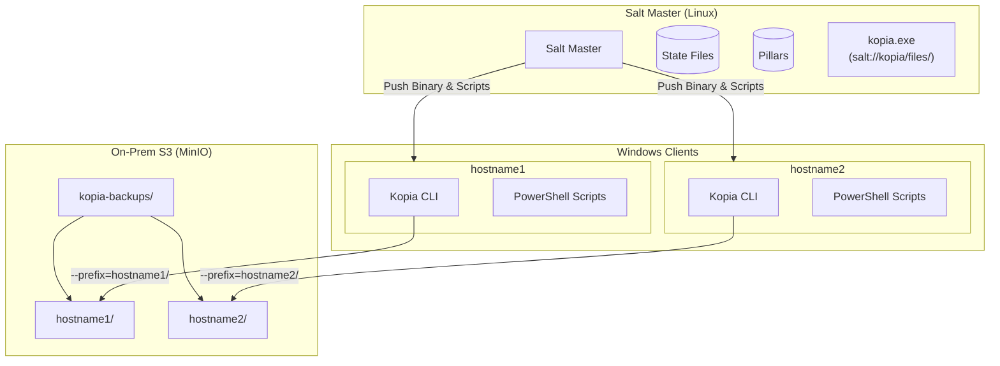

# Kopia CLI Windows Implementation Plan

Deploy Kopia CLI on Windows machines via SaltStack with direct S3 repository connection for on-demand and scheduled backups to on-prem MinIO storage.

---

## Architecture Diagram



> [!TIP]
> **Per-Device Isolation**: Each device creates its own repository under `kopia-backups/<hostname>/` using the `--prefix` option with `{{ grains['id'] }}/`. This allows easy identification and management of backups per device.

---

## User Review Required

> [!IMPORTANT]
> **S3 Credentials in Pillar**: Credentials will be stored in Salt Pillar (encrypted recommended). Ensure pillar access is restricted.

> [!WARNING]
> **Binary Version**: Download the correct Kopia Windows binary from GitHub and place it on the Salt Master before deployment.

---

## Proposed Changes

### Phase 1: Salt Master Setup

#### [NEW] Directory Structure on Salt Master

```
/srv/
├── pillar/
│   ├── top.sls
│   └── kopia/
│       └── init.sls              # Kopia configuration pillar
└── salt/
    └── kopia/
        ├── windows.sls           # Main state file for Windows
        └── files/
            ├── kopia.exe         # Kopia CLI binary (download from GitHub)
            ├── connect.ps1.jinja
            ├── reconnect.ps1.jinja  # Reconnect to existing repo with common username
            ├── run-backup.ps1.jinja
            ├── on-demand-backup.ps1
            ├── install-scheduled-task.ps1.jinja
            ├── maintenance-task.ps1
            ├── kopia-status.ps1
            └── restore-snapshot.ps1
```

---

### Phase 2: Salt Pillar Configuration

#### [NEW] [/srv/pillar/kopia/init.sls](file:///srv/pillar/kopia/init.sls)

```yaml
kopia:
  # S3 Repository Configuration
  s3:
    endpoint: "192.168.158.32:9000"
    bucket: "kopia-backups"
    access_key: "YOUR_MINIO_ACCESS_KEY"
    secret_key: "YOUR_MINIO_SECRET_KEY"
    disable_tls: true
    # Per-device prefix using minion hostname (set dynamically in template)
    # Resulting structure: kopia-backups/hostname1/, kopia-backups/hostname2/
    use_hostname_prefix: true
  
  # Repository password (used for encryption)
  repo_password: "SECURE_REPOSITORY_PASSWORD"
  
  # Common username for repository (used for reconnect, easier to maintain)
  repo_username: "Windowsbackup-user"
  
  # Repository creation settings (CANNOT be changed after creation!)
  repository_settings:
    encryption: "AES256-GCM-HMAC-SHA256"      # Encryption algorithm
    block_hash: "BLAKE2B-256-128"             # Hash algorithm
    object_splitter: "DYNAMIC-4M-BUZHASH"     # Splitter algorithm
    format_version: 3                          # Repository format (2 or 3)
    enable_internal_compression: true          # Internal compression
  
  # Backup paths for Windows clients
  backup_paths:
    - 'C:\Users'
    - 'C:\Data'
  
  # Retention policy
  retention:
    keep_latest: 10
    keep_hourly: 24
    keep_daily: 7
    keep_weekly: 4
    keep_monthly: 12
    keep_annual: 3
  
  # Scheduling
  schedule:
    frequency: "Daily"       # Daily or Hourly
    trigger_time: "02:00"    # For Daily schedule
  
  # Compression and VSS
  compression: "zstd"
  enable_vss: "when-available"
```

> [!CAUTION]
> **Repository Settings Are Immutable**: The `repository_settings` (encryption, hash, splitter, format) are set during `repository create` and **cannot be changed later**. Plan carefully before deployment.

> [!NOTE]
> **Bucket Structure**: With `use_hostname_prefix: true`, each minion creates its repository at:
> ```
> kopia-backups/
> ├── WIN-PC01/       ← Device 1 backups
> ├── WIN-PC02/       ← Device 2 backups
> └── WIN-SERVER01/   ← Device 3 backups
> ```

#### [MODIFY] [/srv/pillar/top.sls](file:///srv/pillar/top.sls)

Add kopia pillar to Windows minions:

```yaml
base:
  'os:Windows':
    - match: grain
    - kopia
```

---

### Phase 3: Download Kopia Binary

#### Download from GitHub (One-time on Salt Master)

```bash
# On Salt Master - download latest Kopia CLI for Windows
KOPIA_VERSION="0.18.1"  # Check https://github.com/kopia/kopia/releases for latest

cd /srv/salt/kopia/files

# Download Windows AMD64 binary
wget "https://github.com/kopia/kopia/releases/download/v${KOPIA_VERSION}/kopia-${KOPIA_VERSION}-windows-x64.zip"

# Extract and rename
unzip "kopia-${KOPIA_VERSION}-windows-x64.zip"
mv kopia.exe kopia.exe  # Already named correctly after extraction

# Cleanup
rm "kopia-${KOPIA_VERSION}-windows-x64.zip"

# Verify
ls -la kopia.exe
```

---

### Phase 4: SaltStack State Files

#### [NEW] [/srv/salt/kopia/windows.sls](file:///srv/salt/kopia/windows.sls)

Main state file for Windows client deployment:

```yaml
# ============================================
# Kopia CLI Windows Deployment State
# ============================================

# Create directory structure
kopia_install_dir:
  file.directory:
    - name: 'C:\Program Files\Kopia'
    - makedirs: True

kopia_data_dir:
  file.directory:
    - name: 'C:\ProgramData\kopia'
    - makedirs: True

kopia_cache_dir:
  file.directory:
    - name: 'C:\ProgramData\kopia\cache'
    - makedirs: True
    - require:
      - file: kopia_data_dir

kopia_logs_dir:
  file.directory:
    - name: 'C:\ProgramData\kopia\logs'
    - makedirs: True
    - require:
      - file: kopia_data_dir

kopia_scripts_dir:
  file.directory:
    - name: 'C:\ProgramData\kopia\scripts'
    - makedirs: True
    - require:
      - file: kopia_data_dir

# Deploy Kopia CLI binary
kopia_binary:
  file.managed:
    - name: 'C:\Program Files\Kopia\kopia.exe'
    - source: salt://kopia/files/kopia.exe
    - require:
      - file: kopia_install_dir

# Add Kopia to system PATH
kopia_path:
  win_path.exists:
    - name: 'C:\Program Files\Kopia'
    - require:
      - file: kopia_binary

# Set KOPIA_PASSWORD environment variable (for automation)
kopia_password_env:
  environ.setenv:
    - name: KOPIA_PASSWORD
    - value: {{ pillar['kopia']['repo_password'] }}
    - update_minion: True

# Set S3 credentials as environment variables (secure storage)
kopia_s3_endpoint_env:
  environ.setenv:
    - name: KOPIA_S3_ENDPOINT
    - value: {{ pillar['kopia']['s3']['endpoint'] }}
    - update_minion: True

kopia_s3_bucket_env:
  environ.setenv:
    - name: KOPIA_S3_BUCKET
    - value: {{ pillar['kopia']['s3']['bucket'] }}
    - update_minion: True

kopia_s3_access_key_env:
  environ.setenv:
    - name: KOPIA_S3_ACCESS_KEY
    - value: {{ pillar['kopia']['s3']['access_key'] }}
    - update_minion: True

kopia_s3_secret_key_env:
  environ.setenv:
    - name: KOPIA_S3_SECRET_KEY
    - value: {{ pillar['kopia']['s3']['secret_key'] }}
    - update_minion: True

kopia_repo_username_env:
  environ.setenv:
    - name: KOPIA_REPO_USERNAME
    - value: {{ pillar['kopia']['repo_username'] | default('kopia-backup-user') }}
    - update_minion: True

# Deploy connect script (templated with pillar data)
kopia_connect_script:
  file.managed:
    - name: 'C:\ProgramData\kopia\scripts\connect.ps1'
    - source: salt://kopia/files/connect.ps1.jinja
    - template: jinja
    - require:
      - file: kopia_scripts_dir
      - environ: kopia_s3_access_key_env
      - environ: kopia_s3_secret_key_env

# Deploy reconnect script (templated with pillar data)
kopia_reconnect_script:
  file.managed:
    - name: 'C:\ProgramData\kopia\scripts\reconnect.ps1'
    - source: salt://kopia/files/reconnect.ps1.jinja
    - template: jinja
    - require:
      - file: kopia_scripts_dir
      - environ: kopia_s3_access_key_env
      - environ: kopia_s3_secret_key_env

# Deploy backup script (templated with pillar data)
kopia_backup_script:
  file.managed:
    - name: 'C:\ProgramData\kopia\scripts\run-backup.ps1'
    - source: salt://kopia/files/run-backup.ps1.jinja
    - template: jinja
    - require:
      - file: kopia_scripts_dir

# Deploy on-demand backup script
kopia_ondemand_script:
  file.managed:
    - name: 'C:\ProgramData\kopia\scripts\on-demand-backup.ps1'
    - source: salt://kopia/files/on-demand-backup.ps1
    - require:
      - file: kopia_scripts_dir

# Deploy scheduled task installer script
kopia_scheduled_task_script:
  file.managed:
    - name: 'C:\ProgramData\kopia\scripts\install-scheduled-task.ps1'
    - source: salt://kopia/files/install-scheduled-task.ps1.jinja
    - template: jinja
    - require:
      - file: kopia_scripts_dir

# Deploy maintenance script
kopia_maintenance_script:
  file.managed:
    - name: 'C:\ProgramData\kopia\scripts\maintenance-task.ps1'
    - source: salt://kopia/files/maintenance-task.ps1
    - require:
      - file: kopia_scripts_dir

# Deploy status check script
kopia_status_script:
  file.managed:
    - name: 'C:\ProgramData\kopia\scripts\kopia-status.ps1'
    - source: salt://kopia/files/kopia-status.ps1
    - require:
      - file: kopia_scripts_dir

# Deploy restore script
kopia_restore_script:
  file.managed:
    - name: 'C:\ProgramData\kopia\scripts\restore-snapshot.ps1'
    - source: salt://kopia/files/restore-snapshot.ps1
    - require:
      - file: kopia_scripts_dir
```

---

### Phase 5: PowerShell Script Templates

#### [NEW] [/srv/salt/kopia/files/connect.ps1.jinja](file:///srv/salt/kopia/files/connect.ps1.jinja)

```powershell
# === Kopia Repository Connection Script ===
# Generated by SaltStack - DO NOT EDIT MANUALLY
# Minion: {{ grains['id'] }}
# NOTE: Credentials are read from system environment variables (set by SaltStack)

$ErrorActionPreference = "Continue"

Write-Host "=== Connecting to Kopia Repository ===" -ForegroundColor Cyan

$KopiaPath = "C:\Program Files\Kopia\kopia.exe"

# Check if already connected (suppress error output)
$status = & $KopiaPath repository status 2>$null

if ($LASTEXITCODE -eq 0) {
    Write-Host "Already connected to repository" -ForegroundColor Green
    exit 0
}

Write-Host "Repository not connected. Proceeding to create/connect..." -ForegroundColor Yellow

# Read credentials from environment variables (set by SaltStack)
$S3Endpoint = $env:KOPIA_S3_ENDPOINT
$S3Bucket = $env:KOPIA_S3_BUCKET
$S3AccessKey = $env:KOPIA_S3_ACCESS_KEY
$S3SecretKey = $env:KOPIA_S3_SECRET_KEY
$RepoPassword = $env:KOPIA_PASSWORD
$RepoUsername = $env:KOPIA_REPO_USERNAME

# Validate required environment variables
if (-not $S3AccessKey -or -not $S3SecretKey -or -not $RepoPassword) {
    Write-Host "ERROR: Missing required environment variables" -ForegroundColor Red
    Write-Host "  Required: KOPIA_S3_ACCESS_KEY, KOPIA_S3_SECRET_KEY, KOPIA_PASSWORD" -ForegroundColor Yellow
    Write-Host "  Run 'salt <minion> state.apply kopia.windows' to set them" -ForegroundColor Yellow
    exit 1
}

if (-not $RepoUsername) { $RepoUsername = "kopia-backup-user" }
if (-not $S3Endpoint) { $S3Endpoint = "{{ pillar['kopia']['s3']['endpoint'] }}" }
if (-not $S3Bucket) { $S3Bucket = "{{ pillar['kopia']['s3']['bucket'] }}" }

$Hostname = "{{ grains['id'] }}"
Write-Host "Connecting to S3 repository at $S3Endpoint..." -ForegroundColor Yellow
Write-Host "Using prefix: $Hostname/" -ForegroundColor Yellow
Write-Host "Using repository username: $RepoUsername" -ForegroundColor Yellow

# Reset ErrorAction to Stop
$ErrorActionPreference = "Stop"

& $KopiaPath repository create s3 `
    --bucket="$S3Bucket" `
    --endpoint="$S3Endpoint" `
    --access-key="$S3AccessKey" `
    --secret-access-key="$S3SecretKey" `
    --password="$RepoPassword" `

    --prefix="{{ grains['id'] }}/" `


    --disable-tls `

    --encryption="{{ pillar['kopia']['repository_settings']['encryption'] }}" `
    --block-hash="{{ pillar['kopia']['repository_settings']['block_hash'] }}" `
    --object-splitter="{{ pillar['kopia']['repository_settings']['object_splitter'] }}" `
    --format-version={{ pillar['kopia']['repository_settings']['format_version'] }} `
    --override-hostname="$RepoUsername" `
    --override-username="$RepoUsername" `
    --no-check-for-updates `
    --cache-directory="C:\ProgramData\kopia\cache"

if ($LASTEXITCODE -eq 0) {
    Write-Host "Successfully created/connected to repository!" -ForegroundColor Green
    
    # Set global policy
    Write-Host "Configuring retention policy..." -ForegroundColor Yellow
    & $KopiaPath policy set --global `
        --keep-latest={{ pillar['kopia']['retention']['keep_latest'] }} `
        --keep-hourly={{ pillar['kopia']['retention']['keep_hourly'] }} `
        --keep-daily={{ pillar['kopia']['retention']['keep_daily'] }} `
        --keep-weekly={{ pillar['kopia']['retention']['keep_weekly'] }} `
        --keep-monthly={{ pillar['kopia']['retention']['keep_monthly'] }} `
        --keep-annual={{ pillar['kopia']['retention']['keep_annual'] }} `
        --compression={{ pillar['kopia']['compression'] }} `
        --enable-volume-shadow-copy={{ pillar['kopia']['enable_vss'] }}
    
    Write-Host "Policy configured successfully!" -ForegroundColor Green
} else {
    Write-Host "ERROR: Failed to create/connect to repository" -ForegroundColor Red
    exit 1
}
```

#### [NEW] [/srv/salt/kopia/files/reconnect.ps1.jinja](file:///srv/salt/kopia/files/reconnect.ps1.jinja)

```powershell
# === Kopia Repository Reconnect Script ===
# Generated by SaltStack - DO NOT EDIT MANUALLY
# Minion: {{ grains['id'] }}
# Purpose: Reconnect to an EXISTING repository using credentials from environment variables
# NOTE: Credentials are read from system environment variables (set by SaltStack)

param(
    [string]$Prefix,
    [switch]$NonInteractive = $false
)

$ErrorActionPreference = "Continue"

Write-Host "=== Reconnecting to Kopia Repository ===" -ForegroundColor Cyan

$KopiaPath = "C:\Program Files\Kopia\kopia.exe"
$DefaultPrefix = "{{ grains['id'] }}"

# Check if already connected (suppress error output)
$status = & $KopiaPath repository status 2>$null

if ($LASTEXITCODE -eq 0) {
    Write-Host "Already connected to repository" -ForegroundColor Green
    exit 0
}

Write-Host "Repository not connected. Attempting to reconnect..." -ForegroundColor Yellow

# Read credentials from environment variables (set by SaltStack)
$S3Endpoint = $env:KOPIA_S3_ENDPOINT
$S3Bucket = $env:KOPIA_S3_BUCKET
$S3AccessKey = $env:KOPIA_S3_ACCESS_KEY
$S3SecretKey = $env:KOPIA_S3_SECRET_KEY
$RepoPassword = $env:KOPIA_PASSWORD
$RepoUsername = $env:KOPIA_REPO_USERNAME

# Validate required environment variables
if (-not $S3AccessKey -or -not $S3SecretKey -or -not $RepoPassword) {
    Write-Host "ERROR: Missing required environment variables" -ForegroundColor Red
    Write-Host "  Required: KOPIA_S3_ACCESS_KEY, KOPIA_S3_SECRET_KEY, KOPIA_PASSWORD" -ForegroundColor Yellow
    Write-Host "  Run 'salt <minion> state.apply kopia.windows' to set them" -ForegroundColor Yellow
    exit 1
}

if (-not $RepoUsername) { $RepoUsername = "kopia-backup-user" }
if (-not $S3Endpoint) { $S3Endpoint = "{{ pillar['kopia']['s3']['endpoint'] }}" }
if (-not $S3Bucket) { $S3Bucket = "{{ pillar['kopia']['s3']['bucket'] }}" }

# Handle prefix - interactive or parameter
if (-not $Prefix) {
    if ($NonInteractive) {
        # Non-interactive mode: use default hostname prefix
        $Prefix = $DefaultPrefix
        Write-Host "Using default prefix: $Prefix/" -ForegroundColor Yellow
    } else {
        # Interactive mode: prompt for prefix
        Write-Host "`nObject prefix determines which repository to connect to." -ForegroundColor Cyan
        Write-Host "Available prefixes correspond to backup folders in bucket: $S3Bucket" -ForegroundColor Cyan
        Write-Host "Default prefix (this host): $DefaultPrefix" -ForegroundColor Yellow
        $userInput = Read-Host "Enter object prefix (or press Enter for default '$DefaultPrefix')"
        
        if ([string]::IsNullOrWhiteSpace($userInput)) {
            $Prefix = $DefaultPrefix
            Write-Host "Using default prefix: $Prefix/" -ForegroundColor Green
        } else {
            $Prefix = $userInput.Trim()
            Write-Host "Using custom prefix: $Prefix/" -ForegroundColor Green
        }
    }
}

Write-Host "Using repository username: $RepoUsername" -ForegroundColor Yellow
Write-Host "Connecting to S3 endpoint: $S3Endpoint" -ForegroundColor Yellow
Write-Host "Using prefix: $Prefix/" -ForegroundColor Yellow

$ErrorActionPreference = "Stop"

try {
    # Connect to EXISTING S3 repository (not create)
    & $KopiaPath repository connect s3 `
        --bucket="$S3Bucket" `
        --endpoint="$S3Endpoint" `
        --access-key="$S3AccessKey" `
        --secret-access-key="$S3SecretKey" `
        --password="$RepoPassword" `
        --prefix="$Prefix/" `

        --disable-tls `

        --override-hostname="$RepoUsername" `
        --override-username="$RepoUsername" `
        --no-check-for-updates `
        --cache-directory="C:\ProgramData\kopia\cache"

    if ($LASTEXITCODE -eq 0) {
        Write-Host "Successfully reconnected to repository!" -ForegroundColor Green
        
        # Verify connection
        Write-Host "`nRepository status:" -ForegroundColor Cyan
        & $KopiaPath repository status
    } else {
        throw "Kopia returned exit code: $LASTEXITCODE"
    }
} catch {
    Write-Host "ERROR: Failed to reconnect to repository" -ForegroundColor Red
    Write-Host "Exception: $($_.Exception.Message)" -ForegroundColor Red
    Write-Host "`nPossible causes:" -ForegroundColor Yellow
    Write-Host "  - Repository does not exist at prefix '$Prefix/'" -ForegroundColor Yellow
    Write-Host "  - Incorrect S3 credentials in environment variables" -ForegroundColor Yellow
    Write-Host "  - Network connectivity issues" -ForegroundColor Yellow
    Write-Host "  - Incorrect repository password" -ForegroundColor Yellow
    exit 1
}
```

#### [NEW] [/srv/salt/kopia/files/run-backup.ps1.jinja](file:///srv/salt/kopia/files/run-backup.ps1.jinja)

```powershell
# === Kopia Scheduled Backup Script ===
# Generated by SaltStack - DO NOT EDIT MANUALLY
# Minion: {{ grains['id'] }}
# NOTE: This script auto-reconnects if repository is disconnected

$KopiaPath = "C:\Program Files\Kopia\kopia.exe"
$ReconnectScript = "C:\ProgramData\kopia\scripts\reconnect.ps1"
$LogDir = "C:\ProgramData\kopia\logs"
$Timestamp = Get-Date -Format "yyyy-MM-dd_HH-mm-ss"
$LogFile = "$LogDir\backup-$Timestamp.log"

# Backup paths from pillar
$BackupPaths = @(

    '{{ path }}'{{ "," if not loop.last else "" }}

)

function Write-Log {
    param([string]$Message)
    $Entry = "$(Get-Date -Format 'yyyy-MM-dd HH:mm:ss') - $Message"
    Write-Host $Entry
    Add-Content -Path $LogFile -Value $Entry
}

Write-Log "=== Starting Kopia Backup on {{ grains['id'] }} ==="

# Verify repository connection and reconnect if needed
Write-Log "Checking repository connection status..."
$repoStatus = & $KopiaPath repository status 2>&1
$repoConnected = $LASTEXITCODE -eq 0

if (-not $repoConnected) {
    Write-Log "Repository NOT connected. Attempting to reconnect..."
    Write-Log "Calling reconnect script: $ReconnectScript -NonInteractive"
    
    # Call reconnect script with NonInteractive flag (uses default hostname prefix)
    $reconnectOutput = & powershell.exe -ExecutionPolicy Bypass -File $ReconnectScript -NonInteractive 2>&1
    $reconnectExitCode = $LASTEXITCODE
    
    # Log reconnect output
    $reconnectOutput | ForEach-Object { Write-Log "  [RECONNECT] $_" }
    
    if ($reconnectExitCode -ne 0) {
        Write-Log "ERROR: Reconnection failed with exit code $reconnectExitCode"
        Write-Log "Backup cannot proceed without repository connection."
        exit 1
    }
    
    # Verify connection after reconnect
    $verifyStatus = & $KopiaPath repository status 2>&1
    if ($LASTEXITCODE -ne 0) {
        Write-Log "ERROR: Repository still not connected after reconnect attempt"
        Write-Log "Status: $verifyStatus"
        exit 1
    }
    
    Write-Log "Successfully reconnected to repository!"
} else {
    Write-Log "Repository connected successfully"
}

# Create snapshots for each path
foreach ($Path in $BackupPaths) {
    if (Test-Path $Path) {
        Write-Log "Creating snapshot: $Path"
        try {
            & $KopiaPath snapshot create $Path 2>&1 | Tee-Object -Append -FilePath $LogFile
            if ($LASTEXITCODE -eq 0) {
                Write-Log "SUCCESS: Snapshot created for $Path"
            } else {
                Write-Log "WARNING: Snapshot may have issues for $Path"
            }
        } catch {
            Write-Log "ERROR: Failed to backup $Path - $($_.Exception.Message)"
        }
    } else {
        Write-Log "SKIPPED: Path not found - $Path"
    }
}

Write-Log "=== Backup Complete ==="

# Cleanup old logs (keep last 30 days)
Get-ChildItem -Path $LogDir -Filter "backup-*.log" | 
    Where-Object { $_.LastWriteTime -lt (Get-Date).AddDays(-30) } | 
    Remove-Item -Force
```

#### [NEW] [/srv/salt/kopia/files/install-scheduled-task.ps1.jinja](file:///srv/salt/kopia/files/install-scheduled-task.ps1.jinja)

```powershell
# === Install Kopia Scheduled Tasks ===
# Generated by SaltStack - DO NOT EDIT MANUALLY

$TaskName = "Kopia {{ pillar['kopia']['schedule']['frequency'] }} Backup"
$ScriptPath = "C:\ProgramData\kopia\scripts\run-backup.ps1"

# Define the action
$Action = New-ScheduledTaskAction `
    -Execute "powershell.exe" `
    -Argument "-NoProfile -ExecutionPolicy Bypass -File `"$ScriptPath`"" `
    -WorkingDirectory "C:\ProgramData\kopia"

# Define trigger based on frequency from pillar

$Trigger = New-ScheduledTaskTrigger -Daily -At "{{ pillar['kopia']['schedule']['trigger_time'] }}"

$Trigger = New-ScheduledTaskTrigger -Once -At "00:00" `
    -RepetitionInterval (New-TimeSpan -Hours 1) `
    -RepetitionDuration (New-TimeSpan -Days 365)


# Task settings
$Settings = New-ScheduledTaskSettingsSet `
    -AllowStartIfOnBatteries `
    -DontStopIfGoingOnBatteries `
    -StartWhenAvailable `
    -WakeToRun `
    -ExecutionTimeLimit (New-TimeSpan -Hours 4)

# Run as SYSTEM
$Principal = New-ScheduledTaskPrincipal `
    -UserId "SYSTEM" `
    -LogonType ServiceAccount `
    -RunLevel Highest

# Remove existing task if present
Unregister-ScheduledTask -TaskName $TaskName -Confirm:$false -ErrorAction SilentlyContinue

# Create new task
Register-ScheduledTask `
    -TaskName $TaskName `
    -Action $Action `
    -Trigger $Trigger `
    -Settings $Settings `
    -Principal $Principal `
    -Description "Automated Kopia backup to S3 storage - Deployed by SaltStack"

Write-Host "Scheduled task '$TaskName' created successfully!" -ForegroundColor Green

# Also create weekly maintenance task
$MaintenanceTaskName = "Kopia Weekly Maintenance"
$MaintenanceAction = New-ScheduledTaskAction `
    -Execute "powershell.exe" `
    -Argument "-NoProfile -ExecutionPolicy Bypass -File C:\ProgramData\kopia\scripts\maintenance-task.ps1" `
    -WorkingDirectory "C:\ProgramData\kopia"

$MaintenanceTrigger = New-ScheduledTaskTrigger -Weekly -DaysOfWeek Sunday -At "03:00"

Unregister-ScheduledTask -TaskName $MaintenanceTaskName -Confirm:$false -ErrorAction SilentlyContinue

Register-ScheduledTask `
    -TaskName $MaintenanceTaskName `
    -Action $MaintenanceAction `
    -Trigger $MaintenanceTrigger `
    -Settings $Settings `
    -Principal $Principal `
    -Description "Weekly Kopia maintenance - Deployed by SaltStack"

Write-Host "Maintenance task '$MaintenanceTaskName' created successfully!" -ForegroundColor Green
```

#### [NEW] [/srv/salt/kopia/files/on-demand-backup.ps1](file:///srv/salt/kopia/files/on-demand-backup.ps1)

```powershell
# === On-Demand Backup Script ===
# Interactive single path backup

param(
    [Parameter(Mandatory=$true)]
    [string]$Path,
    [string]$Description = ""
)

$KopiaPath = "C:\Program Files\Kopia\kopia.exe"

Write-Host "=== Kopia On-Demand Backup ===" -ForegroundColor Cyan

if (-not (Test-Path $Path)) {
    Write-Host "ERROR: Path not found: $Path" -ForegroundColor Red
    exit 1
}

Write-Host "Backing up: $Path" -ForegroundColor Yellow

$startTime = Get-Date

if ($Description) {
    & $KopiaPath snapshot create $Path --description="$Description"
} else {
    & $KopiaPath snapshot create $Path
}

$duration = (Get-Date) - $startTime
Write-Host "=== Backup completed in $($duration.TotalSeconds) seconds ===" -ForegroundColor Green

# Show recent snapshots
Write-Host "`nRecent snapshots:" -ForegroundColor Cyan
& $KopiaPath snapshot list --all | Select-Object -Last 10
```

#### [NEW] [/srv/salt/kopia/files/maintenance-task.ps1](file:///srv/salt/kopia/files/maintenance-task.ps1)

```powershell
# === Kopia Maintenance Script ===
# Run weekly to optimize repository

$KopiaPath = "C:\Program Files\Kopia\kopia.exe"
$LogDir = "C:\ProgramData\kopia\logs"
$Timestamp = Get-Date -Format "yyyy-MM-dd_HH-mm-ss"
$LogFile = "$LogDir\maintenance-$Timestamp.log"

function Write-Log {
    param([string]$Message)
    $Entry = "$(Get-Date -Format 'yyyy-MM-dd HH:mm:ss') - $Message"
    Write-Host $Entry
    Add-Content -Path $LogFile -Value $Entry
}

Write-Log "=== Starting Kopia Maintenance ==="

# Run quick maintenance (default behavior)
Write-Log "Running quick maintenance..."
& $KopiaPath maintenance run 2>&1 | Tee-Object -Append -FilePath $LogFile

# Run full maintenance (includes blob cleanup)
Write-Log "Running full maintenance..."
& $KopiaPath maintenance run --full 2>&1 | Tee-Object -Append -FilePath $LogFile

# Show repository status
Write-Log "Repository status:"
& $KopiaPath repository status 2>&1 | Tee-Object -Append -FilePath $LogFile

# Show blob stats
Write-Log "Blob statistics:"
& $KopiaPath blob stats 2>&1 | Tee-Object -Append -FilePath $LogFile

Write-Log "=== Maintenance Complete ==="
```

#### [NEW] [/srv/salt/kopia/files/kopia-status.ps1](file:///srv/salt/kopia/files/kopia-status.ps1)

```powershell
# === Kopia Status Script ===

$KopiaPath = "C:\Program Files\Kopia\kopia.exe"

Write-Host "=== Kopia Backup Status ===" -ForegroundColor Cyan

# Repository status
Write-Host "`n--- Repository Status ---" -ForegroundColor Yellow
& $KopiaPath repository status

# Recent snapshots
Write-Host "`n--- Recent Snapshots ---" -ForegroundColor Yellow
& $KopiaPath snapshot list --all | Select-Object -Last 15

# Policy info
Write-Host "`n--- Global Policy ---" -ForegroundColor Yellow
& $KopiaPath policy show --global

# Cache info
Write-Host "`n--- Cache Status ---" -ForegroundColor Yellow
& $KopiaPath cache info
```

#### [NEW] [/srv/salt/kopia/files/restore-snapshot.ps1](file:///srv/salt/kopia/files/restore-snapshot.ps1)

```powershell
# === Kopia Restore Script ===
# Restores snapshots to C:\restore\<SnapshotId>_<SanitizedSourcePath>\
# This structure prevents overwrites and organizes restores by snapshot

param(
    [string]$SnapshotId,
    [switch]$ListSnapshots = $false
)

$KopiaPath = "C:\Program Files\Kopia\kopia.exe"
$BaseRestorePath = "C:\restore"

# Ensure base restore directory exists
if (-not (Test-Path $BaseRestorePath)) {
    New-Item -ItemType Directory -Path $BaseRestorePath -Force | Out-Null
}

if ($ListSnapshots) {
    Write-Host "=== Available Snapshots ===" -ForegroundColor Cyan
    & $KopiaPath snapshot list --all
    Write-Host "`nUsage: restore-snapshot.ps1 -SnapshotId <id>" -ForegroundColor Yellow
    Write-Host "`nRestores will be saved to: $BaseRestorePath\<SnapshotId>_<SourcePath>\" -ForegroundColor Gray
    exit 0
}

if (-not $SnapshotId) {
    Write-Host "ERROR: Please provide -SnapshotId or use -ListSnapshots to see available snapshots" -ForegroundColor Red
    Write-Host "Usage: restore-snapshot.ps1 -SnapshotId <id>" -ForegroundColor Yellow
    exit 1
}

Write-Host "=== Kopia Restore ===" -ForegroundColor Cyan
Write-Host "Snapshot ID: $SnapshotId" -ForegroundColor White

# Parse snapshot list to find source path for this snapshot ID
# Output format: "  2026-01-06 14:47:39 IST kfd84c00f95aa2f5000591e112892092a 1.3 GB ..."
# Source path is in header line: "kopia-backup-user@kopia-backup-user:C:\backup"
$snapshotListOutput = & $KopiaPath snapshot list --all 2>&1
$sourcePath = $null
$currentSourcePath = $null

foreach ($line in $snapshotListOutput) {
    # Match header lines like: "kopia-backup-user@kopia-backup-user:C:\backup"
    if ($line -match '^[^@]+@[^:]+:(.+)$') {
        $currentSourcePath = $Matches[1].Trim()
    }
    # Match snapshot lines containing our ID
    elseif ($line -match $SnapshotId) {
        $sourcePath = $currentSourcePath
        break
    }
}

# Fallback if source path not found
if (-not $sourcePath) {
    Write-Host "WARNING: Could not determine source path from snapshot list" -ForegroundColor Yellow
    $sourcePath = "backup"
}

Write-Host "Source Path:  $sourcePath" -ForegroundColor White

# Sanitize source path for folder name (replace invalid chars with underscores)
# C:\Users\Documents -> C_Users_Documents
$sanitizedPath = $sourcePath -replace '[\\/:*?"<>|]', '_' -replace '__+', '_' -replace '^_|_$', ''

# Create restore folder: <SnapshotId>_<SanitizedSourcePath>
$restoreFolderName = "${SnapshotId}_${sanitizedPath}"
$fullTargetPath = Join-Path $BaseRestorePath $restoreFolderName

# Handle existing folder - add timestamp for uniqueness
if (Test-Path $fullTargetPath) {
    Write-Host "Folder exists, adding timestamp..." -ForegroundColor Yellow
    $timestamp = Get-Date -Format "yyyyMMdd_HHmmss"
    $restoreFolderName = "${SnapshotId}_${sanitizedPath}_${timestamp}"
    $fullTargetPath = Join-Path $BaseRestorePath $restoreFolderName
}

# Create target directory
New-Item -ItemType Directory -Path $fullTargetPath -Force | Out-Null

Write-Host "Restore To:   $fullTargetPath" -ForegroundColor Green
Write-Host ""

$startTime = Get-Date

# Perform restore
& $KopiaPath restore $SnapshotId $fullTargetPath

$exitCode = $LASTEXITCODE
$duration = (Get-Date) - $startTime

if ($exitCode -eq 0) {
    Write-Host "`n=== Restore Complete ===" -ForegroundColor Green
    Write-Host "Duration: $([math]::Round($duration.TotalSeconds, 1)) seconds" -ForegroundColor White
    Write-Host "Location: $fullTargetPath" -ForegroundColor Cyan
    
    # Show restored contents summary
    $items = Get-ChildItem -Path $fullTargetPath -Recurse -ErrorAction SilentlyContinue
    $fileCount = ($items | Where-Object { -not $_.PSIsContainer }).Count
    $totalSize = ($items | Measure-Object -Property Length -Sum -ErrorAction SilentlyContinue).Sum
    $sizeMB = [math]::Round($totalSize / 1MB, 2)
    Write-Host "Files: $fileCount | Size: $sizeMB MB" -ForegroundColor White
} else {
    Write-Host "`n=== Restore Failed ===" -ForegroundColor Red
    Write-Host "Exit code: $exitCode" -ForegroundColor Red
    Write-Host "Verify snapshot ID is correct using -ListSnapshots" -ForegroundColor Yellow
    exit $exitCode
}
```

---

### Phase 6: Repository Initialization (One-Time)

> [!IMPORTANT]
> The S3 repository must be created **once** before deploying to clients. Run this from the Salt Master or any machine with Kopia installed.

```bash
# On Salt Master (install kopia first)
# Or run on the first Windows client manually

kopia repository create s3 \
    --bucket=kopia-backups \
    --endpoint=192.168.158.32:9000 \
    --access-key=YOUR_ACCESS_KEY \
    --secret-access-key=YOUR_SECRET_KEY \
    --disable-tls \
    --password=SECURE_REPOSITORY_PASSWORD
```

---

## Verification Plan

### Deployment Commands (Salt Master)

```bash
# 1. Test pillar data
salt 'win-*' pillar.get kopia

# 2. Apply state to all Windows minions
salt 'win-*' state.apply kopia.windows

# 3. Verify Kopia installation
salt 'win-*' cmd.run '"C:\Program Files\Kopia\kopia.exe" --version'

# 4. Connect clients to repository
salt '*' cmd.run 'powershell -ExecutionPolicy Bypass -File "C:\ProgramData\kopia\scripts\connect.ps1"'

# 5. Install scheduled tasks
salt '*' cmd.run 'powershell -ExecutionPolicy Bypass -File "C:\ProgramData\kopia\scripts\install-scheduled-task.ps1"'

# 6. Verify scheduled tasks
salt '*' cmd.run 'powershell Get-ScheduledTask -TaskName "Kopia*"'

# 7. Test on-demand backup (small test folder)
salt 'win-*' cmd.run 'mkdir C:\KopiaTest; echo test > C:\KopiaTest\test.txt'
salt 'win-*' cmd.run '"C:\Program Files\Kopia\kopia.exe" snapshot create C:\KopiaTest'
OR
salt -t 60 '*' cmd.run 'powershell -ExecutionPolicy Bypass -File "C:\ProgramData\kopia\scripts\on-demand-backup.ps1" -Path "C:\svn-backup" -Description "Timeout Test"'

# 8. Check backup status
salt '*' cmd.run 'powershell -ExecutionPolicy Bypass -File "C:\ProgramData\kopia\scripts\kopia-status.ps1"'

# 9. Test full restore
salt 'win-*' cmd.run 'powershell -ExecutionPolicy Bypass -File "C:\ProgramData\kopia\scripts\restore-snapshot.ps1" -SnapshotId fd83205145273b0551b6e40d337cb3c1'
# Specify prefix directly
salt 'win-*' cmd.run 'powershell -ExecutionPolicy Bypass -File "C:\ProgramData\kopia\scripts\restore-snapshot.ps1" -Prefix "other-device"'
# Automated/Salt use - no prompt, uses hostname
salt 'win-*' cmd.run 'powershell -ExecutionPolicy Bypass -File "C:\ProgramData\kopia\scripts\restore-snapshot.ps1" -NonInteractive'

# 10. Test maintenance
salt '*' cmd.run 'powershell -ExecutionPolicy Bypass -File "C:\ProgramData\kopia\scripts\maintenance-task.ps1"'

# 11. Test scheduled backup
salt 'win-*' cmd.run 'powershell Get-ScheduledTask -TaskName "Kopia*"'

# 12. List snapshots using script
salt 'win-*' cmd.run 'powershell -ExecutionPolicy Bypass -File "C:\ProgramData\kopia\scripts\restore-snapshot.ps1" -ListSnapshots'

# 13. Salt JID Status 
salt-run jobs.active
or
salt-run jobs.lookup_jid <THE_JID_RETURNED>

# 14. To disconnect from the repository
salt 'win-2025-server' cmd.run '"C:\Program Files\Kopia\kopia.exe" repository disconnect'

#15. To connect to the repository
salt 'server_hostname' cmd.run 'powershell -ExecutionPolicy Bypass -File "C:\ProgramData\kopia\scripts\reconnect.ps1" -Prefix "prefix_hostname"'


```

### Manual Verification

1. **Check MinIO Console** - Verify backup data appears in the bucket
2. **Run scheduled task manually** - Right-click task in Task Scheduler → Run
3. **Review logs** - Check `C:\ProgramData\kopia\logs\` for backup results
4. **Test full restore** - Use `restore-snapshot.ps1` script

---

## Quick Reference

### Deployment Workflow

```bash
# Step 1: Download Kopia binary to Salt Master
cd /srv/salt/kopia/files
wget https://github.com/kopia/kopia/releases/download/v0.18.1/kopia-0.18.1-windows-x64.zip
unzip kopia-0.18.1-windows-x64.zip

# Step 2: Create repository (one-time)
kopia repository create s3 --bucket=kopia-backups --endpoint=192.168.158.32:9000 ...

# Step 3: Deploy to Windows clients
salt 'win-*' state.apply kopia.windows

# Step 4: Connect and configure clients
salt 'win-*' cmd.run 'powershell -ExecutionPolicy Bypass -File "C:\ProgramData\kopia\scripts\connect.ps1"'
salt 'win-*' cmd.run 'powershell -ExecutionPolicy Bypass -File "C:\ProgramData\kopia\scripts\install-scheduled-task.ps1"'
```

### On-Demand Backup from Salt

```bash
# Backup specific path on specific minion
salt 'win-client01' cmd.run '"C:\Program Files\Kopia\kopia.exe" snapshot create "C:\Users\JohnDoe\Documents"'

# Backup default paths on all Windows minions
salt 'win-*' cmd.run 'powershell -ExecutionPolicy Bypass -File "C:\ProgramData\kopia\scripts\run-backup.ps1"'
```

---

## File Summary

| File | Location | Purpose |
|------|----------|---------|
| `init.sls` | `/srv/pillar/kopia/` | Pillar with S3 creds, paths, retention policy |
| `windows.sls` | `/srv/salt/kopia/` | Main Salt state for Windows deployment |
| `kopia.exe` | `/srv/salt/kopia/files/` | Kopia CLI binary |
| `connect.ps1.jinja` | `/srv/salt/kopia/files/` | Repository connection script (templated) |
| `reconnect.ps1.jinja` | `/srv/salt/kopia/files/` | Reconnect to existing repo with common username |
| `run-backup.ps1.jinja` | `/srv/salt/kopia/files/` | Scheduled backup script (templated) |
| `install-scheduled-task.ps1.jinja` | `/srv/salt/kopia/files/` | Task Scheduler setup (templated) |
| `on-demand-backup.ps1` | `/srv/salt/kopia/files/` | Interactive single-path backup |
| `maintenance-task.ps1` | `/srv/salt/kopia/files/` | Weekly repository maintenance |
| `kopia-status.ps1` | `/srv/salt/kopia/files/` | Quick status overview |
| `restore-snapshot.ps1` | `/srv/salt/kopia/files/` | Data recovery script |
