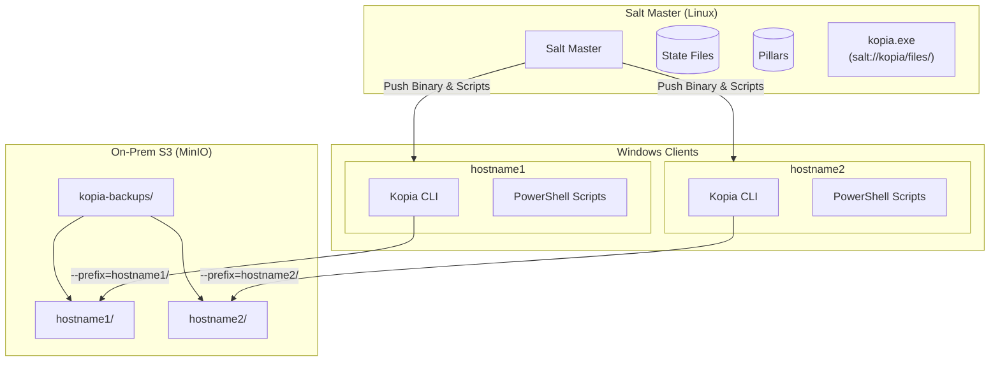
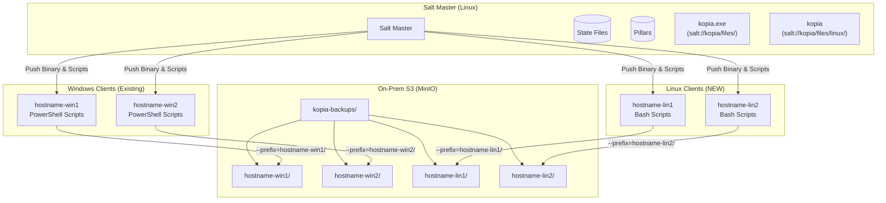

# Kopia CLI Windows Implementation Plan

Deploy Kopia CLI on Windows machines via SaltStack with direct S3 repository connection for on-demand and scheduled backups to on-prem MinIO storage.

---

## Architecture Diagram


```mermaid
flowchart TB
    subgraph SaltMaster["Salt Master (Linux)"]
        SM[Salt Master]
        States[(State Files)]
        Pillars[(Pillars)]
        Binary["kopia.exe<br/>(salt://kopia/files/)"]
    end

    subgraph WindowsClients["Windows Clients"]
        subgraph WC1["hostname1"]
            CLI1["Kopia CLI"]
            Scripts1["PowerShell Scripts"]
        end
        subgraph WC2["hostname2"]
            CLI2["Kopia CLI"]
            Scripts2["PowerShell Scripts"]
        end
    end

    subgraph S3Storage["On-Prem S3 (MinIO)"]
        Bucket["kopia-backups/"]
        Folder1["hostname1/"]
        Folder2["hostname2/"]
        Bucket --> Folder1
        Bucket --> Folder2
    end

    SM -->|"Push Binary & Scripts"| WC1
    SM -->|"Push Binary & Scripts"| WC2
    CLI1 -->|"--prefix=hostname1/"| Folder1
    CLI2 -->|"--prefix=hostname2/"| Folder2
```

> [!TIP]
> **Per-Device Isolation**: Each device creates its own repository under `kopia-backups/<hostname>/` using the `--prefix` option with `{{ grains['id'] }}/`. This allows easy identification and management of backups per device.

---

## User Review Required

> [!IMPORTANT]
> **S3 Credentials in Pillar**: Credentials will be stored in Salt Pillar (encrypted recommended). Ensure pillar access is restricted.

> [!WARNING]
> **Binary Version**: Download the correct Kopia Windows binary from GitHub and place it on the Salt Master before deployment.

---

## Proposed Changes

### Phase 1: Salt Master Setup

#### [NEW] Directory Structure on Salt Master

```
/etc/salt/master.d/
└── kopia_reactor.conf              # [NEW] Reactor configuration

/srv/
├── pillar/
│   ├── top.sls                     # Existing (no changes needed)
│   └── kopia/
│       └── init.sls                # Existing - S3 creds, paths, retention policy
├── reactor/                        # [NEW] Reactor directory
│   └── kopia_alert.sls             # [NEW] Reactor to call runner
└── salt/
    ├── _runners/                   # [NEW] Custom runners
    │   └── kopia_alert.py          # [NEW] Runner to send alerts
    └── kopia/
        ├── windows.sls             # Existing - Main Salt state
        ├── kopia_alerting.yaml     # [NEW] Alert config
        ├── send_alert.py           # [NEW] Python script for sending alerts
        └── files/
            ├── kopia.exe                       # Existing
            ├── connect.ps1.jinja               # Existing
            ├── reconnect.ps1.jinja             # Existing
            ├── run-backup.ps1.jinja            # [MODIFY] Add event.send
            ├── install-scheduled-task.ps1.jinja # Existing
            ├── on-demand-backup.ps1            # Existing
            ├── maintenance-task.ps1            # [MODIFY] Add event.send
            ├── kopia-status.ps1                # Existing
            └── restore-snapshot.ps1            # Existing
```

---

### Phase 2: Salt Pillar Configuration

#### [NEW] [/srv/pillar/kopia/init.sls](file:///srv/pillar/kopia/init.sls)

```yaml
kopia:
  # S3 Repository Configuration
  s3:
    endpoint: "192.168.158.32:9000"
    bucket: "kopia-backups"
    access_key: "YOUR_MINIO_ACCESS_KEY"
    secret_key: "YOUR_MINIO_SECRET_KEY"
    disable_tls: true
    # Per-device prefix using minion hostname (set dynamically in template)
    # Resulting structure: kopia-backups/hostname1/, kopia-backups/hostname2/
    use_hostname_prefix: true
  
  # Repository password (used for encryption)
  repo_password: "SECURE_REPOSITORY_PASSWORD"
  
  # Common username for repository (used for reconnect, easier to maintain)
  repo_username: "Windowsbackup-user"
  
  # Repository creation settings (CANNOT be changed after creation!)
  repository_settings:
    encryption: "AES256-GCM-HMAC-SHA256"      # Encryption algorithm
    block_hash: "BLAKE2B-256-128"             # Hash algorithm
    object_splitter: "DYNAMIC-4M-BUZHASH"     # Splitter algorithm
    format_version: 3                          # Repository format (2 or 3)
    enable_internal_compression: true          # Internal compression
  
  # Backup paths for Windows clients
  backup_paths:
    - 'C:\Users'
    - 'C:\Data'
  
  # Retention policy
  retention:
    keep_latest: 10
    keep_hourly: 24
    keep_daily: 7
    keep_weekly: 4
    keep_monthly: 12
    keep_annual: 3
  
  # Scheduling (three modes supported)
  schedule:
    frequency: "Daily"       # Options: "Daily", "Hourly", or "Custom"
    trigger_time: "02:00"    # For Daily: single run at this time
    # interval_hours: 3      # For Custom: repeat every N hours (used when frequency="Custom")
    # Option 1: Daily backup at specific time
    # schedule:
    #   frequency: "Daily"
    #   trigger_time: "02:00"

    # Option 2: Hourly backup
    # schedule:
    #   frequency: "Hourly"

    # Option 3: Custom interval (e.g., every 3 hours)
    # schedule:
    #   frequency: "Custom"
    #   interval_hours: 3

  # Compression and VSS
  compression: "zstd"
  enable_vss: "when-available"

email:
  enabled: true
  smtp_server: 'smtp.gmail.com'
  smtp_port: 587
  use_ssl: true
  from_address: 'your-account@gmail.com'
  to_address: 'backup-team@example.com'
  username: 'your-account@gmail.com'
  password: 'your-app-password'

slack:
  enabled: false
  webhook_url: 'https://hooks.slack.com/services/YOUR/WEBHOOK/URL'

teams:
  enabled: false
  webhook_url: 'https://outlook.office.com/webhook/YOUR/WEBHOOK/URL'

settings:
  send_on_success: true
  send_on_failure: true

  # ==========================================
  # Ignore Configuration (deployed as .kopiaignore files)
  # ==========================================
  # All patterns follow .gitignore syntax
  # Changes here will update .kopiaignore files on next Salt run
  
  ignore:
    # File extensions to ignore (without leading dot for wildcards)
    extensions:
      - "tmp"           # Temporary files
      - "temp"
      - "log"           # Log files
      - "bak"           # Backup files
      - "old"
      - "swp"           # Swap files
      - "pyc"           # Python compiled
    
    # Specific filenames to ignore
    files:
      - "Thumbs.db"           # Windows thumbnail cache
      - "desktop.ini"         # Windows folder config
      - ".DS_Store"           # macOS metadata
      - "~$*"                 # Office temp files (pattern)
    
    # Directories/paths to ignore (use trailing slash for directories)
    directories:
      - "node_modules/"
      - ".git/"
      - ".vscode/"
      - "__pycache__/"
      - "$RECYCLE.BIN/"
      - "System Volume Information/"
      - "AppData/Local/Temp/"
      - "AppData/Local/Microsoft/Windows/INetCache/"
      - "AppData/Local/Google/Chrome/User Data/*/Cache/"
      - "AppData/Local/Mozilla/Firefox/Profiles/*/cache2/"
      - "AppData/Local/CrashDumps/"
    
    # Additional custom patterns (raw .gitignore syntax)
    custom_patterns: []
```

> [!CAUTION]
> **Repository Settings Are Immutable**: The `repository_settings` (encryption, hash, splitter, format) are set during `repository create` and **cannot be changed later**. Plan carefully before deployment.

> [!NOTE]
> **Bucket Structure**: With `use_hostname_prefix: true`, each minion creates its repository at:
> ```
> kopia-backups/
> ├── WIN-PC01/       ← Device 1 backups
> ├── WIN-PC02/       ← Device 2 backups
> └── WIN-SERVER01/   ← Device 3 backups
> ```

---

### Ignore Patterns Reference

Kopia excludes files/directories from backups using `.kopiaignore` files (similar to `.gitignore`).

#### How It Works

SaltStack **dynamically generates** `.kopiaignore` files from your pillar configuration and deploys them to each backup path. Any changes to `pillar['kopia']['ignore']` will update the `.kopiaignore` files on the next Salt run.

**Deployment locations** (based on `backup_paths` in pillar):
```
C:\Users\.kopiaignore        ← Applied to C:\Users backup
C:\Data\.kopiaignore         ← Applied to C:\Data backup
```

#### Pillar Structure

```yaml
kopia:
  ignore:
    # File extensions (adds *.ext pattern)
    extensions:
      - "tmp"
      - "log"
      - "bak"
    
    # Specific filenames
    files:
      - "Thumbs.db"
      - "desktop.ini"
      - "~$*"              # Patterns allowed
    
    # Directories (use trailing slash)
    directories:
      - "node_modules/"
      - ".git/"
      - "AppData/Local/Temp/"
    
    # Raw .gitignore patterns
    custom_patterns:
      - "!important.log"   # Negate (include) rule
      - "*.mp4"
```

#### Updating Ignore Rules

1. **Modify pillar** → update `/srv/pillar/kopia/init.sls`
2. **Apply state** → `salt '<minion>' state.apply kopia.windows`
3. **Verify** → `.kopiaignore` files are regenerated with new patterns

> [!TIP]
> **Test Before Backup**: Run `kopia snapshot estimate <path>` to preview what will be included/excluded.

#### Viewing Deployed Ignore Rules

```powershell
# View the deployed ignore file
Get-Content "C:\Users\.kopiaignore"

# Test what files will be backed up
kopia snapshot estimate "C:\Users"
```

---

#### [MODIFY] [/srv/pillar/top.sls](file:///srv/pillar/top.sls)

Add kopia pillar to Windows minions:

```yaml
base:
  'os:Windows':
    - match: grain
    - kopia
```

---

### Phase 3: Download Kopia Binary

#### Download from GitHub (One-time on Salt Master)

```bash
# On Salt Master - download latest Kopia CLI for Windows
KOPIA_VERSION="0.18.1"  # Check https://github.com/kopia/kopia/releases for latest

cd /srv/salt/kopia/files

# Download Windows AMD64 binary
wget "https://github.com/kopia/kopia/releases/download/v${KOPIA_VERSION}/kopia-${KOPIA_VERSION}-windows-x64.zip"

# Extract and rename
unzip "kopia-${KOPIA_VERSION}-windows-x64.zip"
mv kopia.exe kopia.exe  # Already named correctly after extraction

# Cleanup
rm "kopia-${KOPIA_VERSION}-windows-x64.zip"

# Verify
ls -la kopia.exe
```

---

### Phase 4: SaltStack State Files

#### [NEW] [/srv/salt/kopia/windows.sls](file:///srv/salt/kopia/windows.sls)

Main state file for Windows client deployment:

```yaml
# ============================================
# Kopia CLI Windows Deployment State
# ============================================

# Create directory structure
kopia_install_dir:
  file.directory:
    - name: 'C:\Program Files\Kopia'
    - makedirs: True

kopia_data_dir:
  file.directory:
    - name: 'C:\ProgramData\kopia'
    - makedirs: True

kopia_cache_dir:
  file.directory:
    - name: 'C:\ProgramData\kopia\cache'
    - makedirs: True
    - require:
      - file: kopia_data_dir

kopia_logs_dir:
  file.directory:
    - name: 'C:\ProgramData\kopia\logs'
    - makedirs: True
    - require:
      - file: kopia_data_dir

kopia_scripts_dir:
  file.directory:
    - name: 'C:\ProgramData\kopia\scripts'
    - makedirs: True
    - require:
      - file: kopia_data_dir

# Deploy Kopia CLI binary
kopia_binary:
  file.managed:
    - name: 'C:\Program Files\Kopia\kopia.exe'
    - source: salt://kopia/files/kopia.exe
    - require:
      - file: kopia_install_dir

# Add Kopia to system PATH
kopia_path:
  win_path.exists:
    - name: 'C:\Program Files\Kopia'
    - require:
      - file: kopia_binary

# ==============================================
# Set Machine-Level Environment Variables
# ==============================================
kopia_password_env:
  cmd.run:
    - name: '[System.Environment]::SetEnvironmentVariable("KOPIA_PASSWORD", "{{ pillar["kopia"]["repo_password"] }}", "Machine")'
    - shell: powershell

kopia_s3_endpoint_env:
  cmd.run:
    - name: '[System.Environment]::SetEnvironmentVariable("KOPIA_S3_ENDPOINT", "{{ pillar["kopia"]["s3"]["endpoint"] }}", "Machine")'
    - shell: powershell

kopia_s3_bucket_env:
  cmd.run:
    - name: '[System.Environment]::SetEnvironmentVariable("KOPIA_S3_BUCKET", "{{ pillar["kopia"]["s3"]["bucket"] }}", "Machine")'
    - shell: powershell

kopia_s3_access_key_env:
  cmd.run:
    - name: '[System.Environment]::SetEnvironmentVariable("KOPIA_S3_ACCESS_KEY", "{{ pillar["kopia"]["s3"]["access_key"] }}", "Machine")'
    - shell: powershell

kopia_s3_secret_key_env:
  cmd.run:
    - name: '[System.Environment]::SetEnvironmentVariable("KOPIA_S3_SECRET_KEY", "{{ pillar["kopia"]["s3"]["secret_key"] }}", "Machine")'
    - shell: powershell

kopia_repo_username_env:
  cmd.run:
    - name: '[System.Environment]::SetEnvironmentVariable("KOPIA_REPO_USERNAME", "{{ pillar["kopia"]["repo_username"] | default("kopia-backup-user") }}", "Machine")'
    - shell: powershell

# Deploy connect script (templated with pillar data)
kopia_connect_script:
  file.managed:
    - name: 'C:\ProgramData\kopia\scripts\connect.ps1'
    - source: salt://kopia/files/connect.ps1.jinja
    - template: jinja
    - require:
      - file: kopia_scripts_dir
      - cmd: kopia_s3_access_key_env
      - cmd: kopia_s3_secret_key_env

# Deploy reconnect script (templated with pillar data)
kopia_reconnect_script:
  file.managed:
    - name: 'C:\ProgramData\kopia\scripts\reconnect.ps1'
    - source: salt://kopia/files/reconnect.ps1.jinja
    - template: jinja
    - require:
      - file: kopia_scripts_dir
      - cmd: kopia_s3_access_key_env
      - cmd: kopia_s3_secret_key_env

# Deploy backup script (templated with pillar data)
kopia_backup_script:
  file.managed:
    - name: 'C:\ProgramData\kopia\scripts\run-backup.ps1'
    - source: salt://kopia/files/run-backup.ps1.jinja
    - template: jinja
    - require:
      - file: kopia_scripts_dir

# Deploy on-demand backup script
kopia_ondemand_script:
  file.managed:
    - name: 'C:\ProgramData\kopia\scripts\on-demand-backup.ps1'
    - source: salt://kopia/files/on-demand-backup.ps1
    - require:
      - file: kopia_scripts_dir

# Deploy scheduled task installer script
kopia_scheduled_task_script:
  file.managed:
    - name: 'C:\ProgramData\kopia\scripts\install-scheduled-task.ps1'
    - source: salt://kopia/files/install-scheduled-task.ps1.jinja
    - template: jinja
    - require:
      - file: kopia_scripts_dir

# Deploy maintenance script (templated with pillar data)
kopia_maintenance_script:
  file.managed:
    - name: 'C:\ProgramData\kopia\scripts\maintenance-task.ps1'
    - source: salt://kopia/files/maintenance-task.ps1.jinja
    - template: jinja
    - require:
      - file: kopia_scripts_dir

# Deploy status check script
kopia_status_script:
  file.managed:
    - name: 'C:\ProgramData\kopia\scripts\kopia-status.ps1'
    - source: salt://kopia/files/kopia-status.ps1
    - require:
      - file: kopia_scripts_dir

# Deploy restore script
kopia_restore_script:
  file.managed:
    - name: 'C:\ProgramData\kopia\scripts\restore-snapshot.ps1'
    - source: salt://kopia/files/restore-snapshot.ps1
    - require:
      - file: kopia_scripts_dir

# Deploy .kopiaignore file to each backup path

kopia_ignore_file_{{ loop.index }}:
  file.managed:
    - name: '{{ path }}\.kopiaignore'
    - source: salt://kopia/files/.kopiaignore.jinja
    - template: jinja
    - makedirs: True
    - require:
      - file: kopia_binary

```

---

### Phase 5: PowerShell Script Templates

#### [NEW] [/srv/salt/kopia/files/.kopiaignore.jinja](file:///srv/salt/kopia/files/.kopiaignore.jinja)

This file is deployed to the root of each backup path (e.g., `C:\Users\.kopiaignore`).

```gitignore
# === Kopia Ignore File ===
# Generated by SaltStack - DO NOT EDIT MANUALLY
# Minion: {{ grains['id'] }}
# Last updated: {{ None | strftime('%Y-%m-%d %H:%M:%S') }}
# Syntax: .gitignore-style patterns (relative to this file's location)
#
# To modify: Update pillar['kopia']['ignore'] and run:
#   salt '<minion>' state.apply kopia.windows

# ==========================================
# Ignored File Extensions
# ==========================================

*.{{ ext }}


# ==========================================
# Ignored Files
# ==========================================

{{ file }}


# ==========================================
# Ignored Directories
# ==========================================

{{ dir }}


# ==========================================
# Custom Patterns
# ==========================================

{{ pattern }}

```

> [!NOTE]
> **How It Works**: Kopia automatically reads `.kopiaignore` files in directories being backed up. Patterns work like `.gitignore` - they apply relative to the file's location.

---

#### [NEW] [/srv/salt/kopia/files/connect.ps1.jinja](file:///srv/salt/kopia/files/connect.ps1.jinja)

```powershell
# === Kopia Repository Connection Script ===
# Generated by SaltStack - DO NOT EDIT MANUALLY
# Minion: {{ grains['id'] }}
# NOTE: Credentials are read from system environment variables (set by SaltStack)

$ErrorActionPreference = "Continue"

Write-Host "=== Connecting to Kopia Repository ===" -ForegroundColor Cyan

$KopiaPath = "C:\Program Files\Kopia\kopia.exe"

# Check if already connected (suppress error output)
$status = & $KopiaPath repository status 2>$null

if ($LASTEXITCODE -eq 0) {
    Write-Host "Already connected to repository" -ForegroundColor Green
    exit 0
}

Write-Host "Repository not connected. Proceeding to create/connect..." -ForegroundColor Yellow

# Read credentials from environment variables (set by SaltStack)
$S3Endpoint = $env:KOPIA_S3_ENDPOINT
$S3Bucket = $env:KOPIA_S3_BUCKET
$S3AccessKey = $env:KOPIA_S3_ACCESS_KEY
$S3SecretKey = $env:KOPIA_S3_SECRET_KEY
$RepoPassword = $env:KOPIA_PASSWORD
$RepoUsername = $env:KOPIA_REPO_USERNAME

# Validate required environment variables
if (-not $S3AccessKey -or -not $S3SecretKey -or -not $RepoPassword) {
    Write-Host "ERROR: Missing required environment variables" -ForegroundColor Red
    Write-Host "  Required: KOPIA_S3_ACCESS_KEY, KOPIA_S3_SECRET_KEY, KOPIA_PASSWORD" -ForegroundColor Yellow
    Write-Host "  Run 'salt <minion> state.apply kopia.windows' to set them" -ForegroundColor Yellow
    exit 1
}

if (-not $RepoUsername) { $RepoUsername = "kopia-backup-user" }
if (-not $S3Endpoint) { $S3Endpoint = "{{ pillar['kopia']['s3']['endpoint'] }}" }
if (-not $S3Bucket) { $S3Bucket = "{{ pillar['kopia']['s3']['bucket'] }}" }

$Hostname = "{{ grains['id'] }}"
Write-Host "Connecting to S3 repository at $S3Endpoint..." -ForegroundColor Yellow
Write-Host "Using prefix: $Hostname/" -ForegroundColor Yellow
Write-Host "Using repository username: $RepoUsername" -ForegroundColor Yellow

# Reset ErrorAction to Stop
$ErrorActionPreference = "Stop"

& $KopiaPath repository create s3 `
    --bucket="$S3Bucket" `
    --endpoint="$S3Endpoint" `
    --access-key="$S3AccessKey" `
    --secret-access-key="$S3SecretKey" `
    --password="$RepoPassword" `

    --prefix="{{ grains['id'] }}/" `


    --disable-tls `

    --encryption="{{ pillar['kopia']['repository_settings']['encryption'] }}" `
    --block-hash="{{ pillar['kopia']['repository_settings']['block_hash'] }}" `
    --object-splitter="{{ pillar['kopia']['repository_settings']['object_splitter'] }}" `
    --format-version={{ pillar['kopia']['repository_settings']['format_version'] }} `
    --override-hostname="$RepoUsername" `
    --override-username="$RepoUsername" `
    --no-check-for-updates `
    --cache-directory="C:\ProgramData\kopia\cache"

if ($LASTEXITCODE -eq 0) {
    Write-Host "Successfully created/connected to repository!" -ForegroundColor Green
    
    # Set global policy (retention and compression only - ignores handled via .kopiaignore files)
    Write-Host "Configuring retention policy..." -ForegroundColor Yellow
    & $KopiaPath policy set --global `
        --keep-latest={{ pillar['kopia']['retention']['keep_latest'] }} `
        --keep-hourly={{ pillar['kopia']['retention']['keep_hourly'] }} `
        --keep-daily={{ pillar['kopia']['retention']['keep_daily'] }} `
        --keep-weekly={{ pillar['kopia']['retention']['keep_weekly'] }} `
        --keep-monthly={{ pillar['kopia']['retention']['keep_monthly'] }} `
        --keep-annual={{ pillar['kopia']['retention']['keep_annual'] }} `
        --compression={{ pillar['kopia']['compression'] }} `
        --max-parallel-file-reads=2 `
        --enable-volume-shadow-copy={{ pillar['kopia']['enable_vss'] }}
    
    Write-Host "Policy configured successfully!" -ForegroundColor Green
    Write-Host "NOTE: Ignore patterns are managed via .kopiaignore files in backup paths" -ForegroundColor Cyan
} else {
    Write-Host "ERROR: Failed to create/connect to repository" -ForegroundColor Red
    exit 1
}
```

#### [NEW] [/srv/salt/kopia/files/reconnect.ps1.jinja](file:///srv/salt/kopia/files/reconnect.ps1.jinja)

```powershell
# === Kopia Repository Reconnect Script ===
# Generated by SaltStack - DO NOT EDIT MANUALLY
# Minion: {{ grains['id'] }}
# Purpose: Reconnect to an EXISTING repository using credentials from environment variables
# NOTE: Credentials are read from system environment variables (set by SaltStack)

param(
    [string]$Prefix,
    [switch]$NonInteractive = $false
)

$ErrorActionPreference = "Continue"

Write-Host "=== Reconnecting to Kopia Repository ===" -ForegroundColor Cyan

$KopiaPath = "C:\Program Files\Kopia\kopia.exe"
$DefaultPrefix = "{{ grains['id'] }}"

# Check if already connected (suppress error output)
$status = & $KopiaPath repository status 2>$null

if ($LASTEXITCODE -eq 0) {
    Write-Host "Already connected to repository" -ForegroundColor Green
    exit 0
}

Write-Host "Repository not connected. Attempting to reconnect..." -ForegroundColor Yellow

# Read credentials from environment variables (set by SaltStack)
$S3Endpoint = $env:KOPIA_S3_ENDPOINT
$S3Bucket = $env:KOPIA_S3_BUCKET
$S3AccessKey = $env:KOPIA_S3_ACCESS_KEY
$S3SecretKey = $env:KOPIA_S3_SECRET_KEY
$RepoPassword = $env:KOPIA_PASSWORD
$RepoUsername = $env:KOPIA_REPO_USERNAME

# Validate required environment variables
if (-not $S3AccessKey -or -not $S3SecretKey -or -not $RepoPassword) {
    Write-Host "ERROR: Missing required environment variables" -ForegroundColor Red
    Write-Host "  Required: KOPIA_S3_ACCESS_KEY, KOPIA_S3_SECRET_KEY, KOPIA_PASSWORD" -ForegroundColor Yellow
    Write-Host "  Run 'salt <minion> state.apply kopia.windows' to set them" -ForegroundColor Yellow
    exit 1
}

if (-not $RepoUsername) { $RepoUsername = "kopia-backup-user" }
if (-not $S3Endpoint) { $S3Endpoint = "{{ pillar['kopia']['s3']['endpoint'] }}" }
if (-not $S3Bucket) { $S3Bucket = "{{ pillar['kopia']['s3']['bucket'] }}" }

# Handle prefix - interactive or parameter
if (-not $Prefix) {
    if ($NonInteractive) {
        # Non-interactive mode: use default hostname prefix
        $Prefix = $DefaultPrefix
        Write-Host "Using default prefix: $Prefix/" -ForegroundColor Yellow
    } else {
        # Interactive mode: prompt for prefix
        Write-Host "`nObject prefix determines which repository to connect to." -ForegroundColor Cyan
        Write-Host "Available prefixes correspond to backup folders in bucket: $S3Bucket" -ForegroundColor Cyan
        Write-Host "Default prefix (this host): $DefaultPrefix" -ForegroundColor Yellow
        $userInput = Read-Host "Enter object prefix (or press Enter for default '$DefaultPrefix')"
        
        if ([string]::IsNullOrWhiteSpace($userInput)) {
            $Prefix = $DefaultPrefix
            Write-Host "Using default prefix: $Prefix/" -ForegroundColor Green
        } else {
            $Prefix = $userInput.Trim()
            Write-Host "Using custom prefix: $Prefix/" -ForegroundColor Green
        }
    }
}

Write-Host "Using repository username: $RepoUsername" -ForegroundColor Yellow
Write-Host "Connecting to S3 endpoint: $S3Endpoint" -ForegroundColor Yellow
Write-Host "Using prefix: $Prefix/" -ForegroundColor Yellow

$ErrorActionPreference = "Stop"

try {
    # Connect to EXISTING S3 repository (not create)
    & $KopiaPath repository connect s3 `
        --bucket="$S3Bucket" `
        --endpoint="$S3Endpoint" `
        --access-key="$S3AccessKey" `
        --secret-access-key="$S3SecretKey" `
        --password="$RepoPassword" `
        --prefix="$Prefix/" `

        --disable-tls `

        --override-hostname="$RepoUsername" `
        --override-username="$RepoUsername" `
        --no-check-for-updates `
        --cache-directory="C:\ProgramData\kopia\cache"

    if ($LASTEXITCODE -eq 0) {
        Write-Host "Successfully reconnected to repository!" -ForegroundColor Green
        
        # Verify connection
        Write-Host "`nRepository status:" -ForegroundColor Cyan
        & $KopiaPath repository status
    } else {
        throw "Kopia returned exit code: $LASTEXITCODE"
    }
} catch {
    Write-Host "ERROR: Failed to reconnect to repository" -ForegroundColor Red
    Write-Host "Exception: $($_.Exception.Message)" -ForegroundColor Red
    Write-Host "`nPossible causes:" -ForegroundColor Yellow
    Write-Host "  - Repository does not exist at prefix '$Prefix/'" -ForegroundColor Yellow
    Write-Host "  - Incorrect S3 credentials in environment variables" -ForegroundColor Yellow
    Write-Host "  - Network connectivity issues" -ForegroundColor Yellow
    Write-Host "  - Incorrect repository password" -ForegroundColor Yellow
    exit 1
}
```

#### [NEW] [/srv/salt/kopia/files/run-backup.ps1.jinja](file:///srv/salt/kopia/files/run-backup.ps1.jinja)

```powershell
# === Kopia Scheduled Backup Script ===
# Generated by SaltStack - DO NOT EDIT MANUALLY
# Minion: {{ grains['id'] }}
# NOTE: This script auto-reconnects if repository is disconnected

$KopiaPath = "C:\Program Files\Kopia\kopia.exe"
$ReconnectScript = "C:\ProgramData\kopia\scripts\reconnect.ps1"
$LogDir = "C:\ProgramData\kopia\logs"
$Timestamp = Get-Date -Format "yyyy-MM-dd_HH-mm-ss"
$LogFile = "$LogDir\backup-$Timestamp.log"
$DetectedCores = (Get-CimInstance -ClassName Win32_ComputerSystem).NumberOfLogicalProcessors
$MaxParallel = [math]::Max(1, [math]::Floor($DetectedCores / 2))
Write-Host "Detected $DetectedCores logical CPU cores, setting parallel uploads to $MaxParallel (50%)"

# Backup paths from pillar
$BackupPaths = @(

    '{{ path }}'{{ "," if not loop.last else "" }}

)

function Write-Log {
    param([string]$Message)
    $Entry = "$(Get-Date -Format 'yyyy-MM-dd HH:mm:ss') - $Message"
    Write-Host $Entry
    Add-Content -Path $LogFile -Value $Entry
}

Write-Log "=== Starting Kopia Backup on {{ grains['id'] }} ==="

# Verify repository connection and reconnect if needed
Write-Log "Checking repository connection status..."
$repoStatus = & $KopiaPath repository status 2>&1
$repoConnected = $LASTEXITCODE -eq 0

if (-not $repoConnected) {
    Write-Log "Repository NOT connected. Attempting to reconnect..."
    Write-Log "Calling reconnect script: $ReconnectScript -NonInteractive"
    
    # Call reconnect script with NonInteractive flag (uses default hostname prefix)
    $reconnectOutput = & powershell.exe -ExecutionPolicy Bypass -File $ReconnectScript -NonInteractive 2>&1
    $reconnectExitCode = $LASTEXITCODE
    
    # Log reconnect output
    $reconnectOutput | ForEach-Object { Write-Log "  [RECONNECT] $_" }
    
    if ($reconnectExitCode -ne 0) {
        Write-Log "ERROR: Reconnection failed with exit code $reconnectExitCode"
        Write-Log "Backup cannot proceed without repository connection."
        
        # Send failure event before exiting
        $AlertTimestamp = Get-Date -Format "yyyy-MM-dd_HH-mm-ss"
        & salt-call event.send kopia/backup/failure type=backup status=failure minion_id={{ grains['id'] }} message=RepositoryConnectionFailed timestamp=$AlertTimestamp --out=quiet
        Write-Log "Sent connection failure event to Salt Master"
        
        exit 1
    }
    
    # Verify connection after reconnect
    $verifyStatus = & $KopiaPath repository status 2>&1
    if ($LASTEXITCODE -ne 0) {
        Write-Log "ERROR: Repository still not connected after reconnect attempt"
        Write-Log "Status: $verifyStatus"
        
        # Send failure event before exiting
        $AlertTimestamp = Get-Date -Format "yyyy-MM-dd_HH-mm-ss"
        & salt-call event.send kopia/backup/failure type=backup status=failure minion_id={{ grains['id'] }} message=RepositoryVerificationFailed timestamp=$AlertTimestamp --out=quiet
        Write-Log "Sent verification failure event to Salt Master"
        
        exit 1
    }
    
    Write-Log "Successfully reconnected to repository!"
} else {
    Write-Log "Repository connected successfully"
}

# ==========================================
# Generate .kopiaignore files for each backup path
# ==========================================
# This ensures ignore files are always up-to-date with pillar settings
# and exist even for newly added backup paths

function Write-KopiaIgnoreFile {
    param([string]$BackupPath)
    
    $IgnoreFile = Join-Path $BackupPath ".kopiaignore"
    
    Write-Log "Generating .kopiaignore for: $BackupPath"
    
    $IgnoreContent = @"
# === Kopia Ignore File ===
# Generated by SaltStack Backup Script - DO NOT EDIT MANUALLY
# Minion: {{ grains['id'] }}
# Generated: $(Get-Date -Format 'yyyy-MM-dd HH:mm:ss')
# To modify: Update pillar['kopia']['ignore'] and re-run Salt state

# ==========================================
# Ignored File Extensions
# ==========================================

*.{{ ext }}


# ==========================================
# Ignored Files
# ==========================================

{{ file }}


# ==========================================
# Ignored Directories
# ==========================================

{{ dir }}


# ==========================================
# Custom Patterns
# ==========================================

{{ pattern }}

"@
    
    try {
        Set-Content -Path $IgnoreFile -Value $IgnoreContent -Encoding UTF8 -Force
        Write-Log "  Created/Updated: $IgnoreFile"
    } catch {
        Write-Log "  WARNING: Failed to write $IgnoreFile - $($_.Exception.Message)"
    }
}

# Generate .kopiaignore for all backup paths before backup
Write-Log "=== Updating .kopiaignore files ==="
foreach ($Path in $BackupPaths) {
    if (Test-Path $Path) {
        Write-KopiaIgnoreFile -BackupPath $Path
    }
}
Write-Log "=== .kopiaignore files updated ==="

# Create snapshots for each path
foreach ($Path in $BackupPaths) {
    if (Test-Path $Path) {
        Write-Log "Creating snapshot: $Path"
        try {
            # Temporarily allow stderr output without triggering NativeCommandError
            # Kopia writes progress messages to stderr which PowerShell treats as errors
            $oldErrorAction = $ErrorActionPreference
            $ErrorActionPreference = 'Continue'
            
            & $KopiaPath snapshot create --parallel=$MaxParallel $Path  2>&1 | Tee-Object -Append -FilePath $LogFile
            $exitCode = $LASTEXITCODE
            
            $ErrorActionPreference = $oldErrorAction
            
            if ($exitCode -eq 0) {
                Write-Log "SUCCESS: Snapshot created for $Path"
            } else {
                Write-Log "WARNING: Snapshot may have issues for $Path (exit code: $exitCode)"
            }
        } catch {
            Write-Log "ERROR: Failed to backup $Path - $($_.Exception.Message)"
        }
    } else {
        Write-Log "SKIPPED: Path not found - $Path"
    }
}

# ==========================================
# Send Event to Salt Master for Alerting
# ==========================================
$Timestamp = Get-Date -Format "yyyy-MM-dd_HH-mm-ss"

# Check if backup had errors
$HasErrors = Select-String -Path $LogFile -Pattern "ERROR" -Quiet

# Use kwargs format (key=value) - JSON escaping doesn't work properly with PowerShell
if ($HasErrors) {
    & salt-call event.send kopia/backup/failure type=backup status=failure minion_id={{ grains['id'] }} message=BackupCompletedWithErrors timestamp=$Timestamp --out=quiet
    Write-Log "Sent backup failure event to Salt Master"
} else {
    & salt-call event.send kopia/backup/success type=backup status=success minion_id={{ grains['id'] }} message=BackupCompletedSuccessfully timestamp=$Timestamp --out=quiet
    Write-Log "Sent backup success event to Salt Master"
}
Write-Log "=== Backup Complete ==="

# ==========================================
# Security Cleanup - Remove stored credentials
# ==========================================
# Delete the Kopia config file to avoid leaving S3 credentials on disk
# The reconnect script will recreate it from environment variables on next run

$KopiaConfigPath = "$env:APPDATA\kopia"
$SystemKopiaConfigPath = "C:\Windows\system32\config\systemprofile\AppData\Roaming\kopia"

# Disconnect repository first (cleanly releases any handles)
Write-Log "Disconnecting from repository..."
& $KopiaPath repository disconnect --config-file="$SystemKopiaConfigPath\repository.config" 2>&1 | Out-Null
Write-Log "Security: Removed config file"

# # Remove config files
# foreach ($ConfigPath in @($KopiaConfigPath, $SystemKopiaConfigPath)) {
#     if (Test-Path "$ConfigPath\repository.config") {
#         try {
#             Remove-Item -Path "$ConfigPath\repository.config" -Force -ErrorAction Stop
#             Write-Log "Security: Removed config file from $ConfigPath"
#         } catch {
#             Write-Log "WARNING: Could not remove config file from $ConfigPath - $($_.Exception.Message)"
#         }
#     }
# }

# Cleanup old logs (keep last 30 days)
Get-ChildItem -Path $LogDir -Filter "backup-*.log" | 
    Where-Object { $_.LastWriteTime -lt (Get-Date).AddDays(-30) } | 
    Remove-Item -Force
```

#### [NEW] [/srv/salt/kopia/files/install-scheduled-task.ps1.jinja](file:///srv/salt/kopia/files/install-scheduled-task.ps1.jinja)

```powershell
# === Install Kopia Scheduled Tasks ===
# Generated by SaltStack - DO NOT EDIT MANUALLY

# FIXED task name - prevents duplicate tasks when frequency changes
$TaskName = "Kopia Scheduled Backup"
$ScriptPath = "C:\ProgramData\kopia\scripts\run-backup.ps1"

# Define the action
$Action = New-ScheduledTaskAction `
    -Execute "powershell.exe" `
    -Argument "-NoProfile -ExecutionPolicy Bypass -File `"$ScriptPath`"" `
    -WorkingDirectory "C:\ProgramData\kopia"

# Define trigger based on frequency from pillar
# IMPORTANT: -RepetitionInterval only works with -Once parameter set, not -Daily
# Workaround: Create Daily trigger, then copy Repetition pattern from a temp -Once trigger
# This ensures task restarts fresh each day AND repeats at the configured interval


# Daily at specified time (single run per day - no repetition needed)
$Trigger = New-ScheduledTaskTrigger -Daily -At "{{ pillar['kopia']['schedule']['trigger_time'] }}"


# Weekly on specified day at specified time
$Trigger = New-ScheduledTaskTrigger `
    -Weekly `
    -DaysOfWeek {{ pillar['kopia']['schedule']['day_of_week'] }} `
    -At "{{ pillar['kopia']['schedule']['trigger_time'] }}"


# Hourly - Daily trigger with repetition every hour
$Trigger = New-ScheduledTaskTrigger -Daily -At "00:00"
# Borrow repetition settings from a temp -Once trigger (workaround for parameter set limitation)
$RepetitionSource = New-ScheduledTaskTrigger -Once -At "00:00" `
    -RepetitionInterval (New-TimeSpan -Hours 1) `
    -RepetitionDuration (New-TimeSpan -Hours 23 -Minutes 59)
$Trigger.Repetition = $RepetitionSource.Repetition


# Custom interval (e.g., every 3 hours) - Daily trigger with custom repetition
$IntervalHours = {{ pillar['kopia']['schedule'].get('interval_hours', 1) }}
$Trigger = New-ScheduledTaskTrigger -Daily -At "00:00"
# Borrow repetition settings from a temp -Once trigger
$RepetitionSource = New-ScheduledTaskTrigger -Once -At "00:00" `
    -RepetitionInterval (New-TimeSpan -Hours $IntervalHours) `
    -RepetitionDuration (New-TimeSpan -Hours 23 -Minutes 59)
$Trigger.Repetition = $RepetitionSource.Repetition



# Task settings
$Settings = New-ScheduledTaskSettingsSet `
    -AllowStartIfOnBatteries `
    -DontStopIfGoingOnBatteries `
    -StartWhenAvailable `
    -WakeToRun `
    -ExecutionTimeLimit (New-TimeSpan -Hours 4)

# Run as SYSTEM
$Principal = New-ScheduledTaskPrincipal `
    -UserId "SYSTEM" `
    -LogonType ServiceAccount `
    -RunLevel Highest

# Check if task already exists - UPDATE instead of recreate
$ExistingTask = Get-ScheduledTask -TaskName $TaskName -ErrorAction SilentlyContinue

if ($ExistingTask) {
    # UPDATE existing task - omit Principal to avoid UserId/GroupId conflict
    Write-Host "Updating existing scheduled task: $TaskName" -ForegroundColor Yellow
    Set-ScheduledTask -TaskName $TaskName -Action $Action -Trigger $Trigger -Settings $Settings
    Write-Host "Scheduled task '$TaskName' updated successfully!" -ForegroundColor Green
} else {
    # Create new task
    Register-ScheduledTask `
        -TaskName $TaskName `
        -Action $Action `
        -Trigger $Trigger `
        -Settings $Settings `
        -Principal $Principal `
        -Description "Automated Kopia backup to S3 storage - Deployed by SaltStack"
    Write-Host "Scheduled task '$TaskName' created successfully!" -ForegroundColor Green
}

# Weekly maintenance task (fixed name - already idempotent)
$MaintenanceTaskName = "Kopia Weekly Maintenance"
$MaintenanceAction = New-ScheduledTaskAction `
    -Execute "powershell.exe" `
    -Argument "-NoProfile -ExecutionPolicy Bypass -File C:\ProgramData\kopia\scripts\maintenance-task.ps1" `
    -WorkingDirectory "C:\ProgramData\kopia"

$MaintenanceTrigger = New-ScheduledTaskTrigger -Weekly -DaysOfWeek Sunday -At "03:00"

$ExistingMaintenance = Get-ScheduledTask -TaskName $MaintenanceTaskName -ErrorAction SilentlyContinue

if ($ExistingMaintenance) {
    # UPDATE existing task - omit Principal to avoid UserId/GroupId conflict
    Set-ScheduledTask -TaskName $MaintenanceTaskName -Action $MaintenanceAction -Trigger $MaintenanceTrigger -Settings $Settings
    Write-Host "Maintenance task '$MaintenanceTaskName' updated successfully!" -ForegroundColor Green
} else {
    Register-ScheduledTask `
        -TaskName $MaintenanceTaskName `
        -Action $MaintenanceAction `
        -Trigger $MaintenanceTrigger `
        -Settings $Settings `
        -Principal $Principal `
        -Description "Weekly Kopia maintenance - Deployed by SaltStack"
    Write-Host "Maintenance task '$MaintenanceTaskName' created successfully!" -ForegroundColor Green
}
```

#### [NEW] [/srv/salt/kopia/files/on-demand-backup.ps1](file:///srv/salt/kopia/files/on-demand-backup.ps1)

```powershell
# === On-Demand Backup Script ===
# Interactive single path backup with logging

param(
    [Parameter(Mandatory=$true)]
    [string]$Path,
    [string]$Description = ""
)

$KopiaPath = "C:\Program Files\Kopia\kopia.exe"
$LogDir = "C:\ProgramData\kopia\logs"
$Timestamp = Get-Date -Format "yyyy-MM-dd_HH-mm-ss"
$SafePath = ($Path -replace '[\\/:*?"<>|]', '_') -replace '__+', '_'
$LogFile = "$LogDir\ondemand-$SafePath-$Timestamp.log"

function Write-Log {
    param([string]$Message)
    $Entry = "$(Get-Date -Format 'yyyy-MM-dd HH:mm:ss') - $Message"
    Write-Host $Entry
    Add-Content -Path $LogFile -Value $Entry
}

Write-Log "=== Kopia On-Demand Backup ==="
Write-Log "Path: $Path"
Write-Log "Description: $Description"
Write-Log "Log file: $LogFile"

if (-not (Test-Path $Path)) {
    Write-Log "ERROR: Path not found: $Path"
    exit 1
}

Write-Log "Starting backup..."
$startTime = Get-Date

try {
    if ($Description) {
        & $KopiaPath snapshot create $Path --description="$Description" 2>&1 | Tee-Object -Append -FilePath $LogFile
    } else {
        & $KopiaPath snapshot create $Path 2>&1 | Tee-Object -Append -FilePath $LogFile
    }
    
    $exitCode = $LASTEXITCODE
    $duration = (Get-Date) - $startTime
    
    if ($exitCode -eq 0) {
        Write-Log "=== Backup completed successfully in $($duration.TotalSeconds) seconds ==="
    } else {
        Write-Log "=== Backup completed with warnings/errors (exit code: $exitCode) in $($duration.TotalSeconds) seconds ==="
    }
} catch {
    Write-Log "ERROR: $($_.Exception.Message)"
    exit 1
}

# Show recent snapshots
Write-Log "Recent snapshots for this path:"
& $KopiaPath snapshot list $Path 2>&1 | Select-Object -Last 5 | Tee-Object -Append -FilePath $LogFile

Write-Log "=== End of On-Demand Backup ==="
```

#### [NEW] [/srv/salt/kopia/files/maintenance-task.ps1.jinja](file:///srv/salt/kopia/files/maintenance-task.ps1.jinja)

```powershell
# === Kopia Maintenance Script ===
# Generated by SaltStack - DO NOT EDIT MANUALLY
# Minion: {{ grains['id'] }}
# Run weekly to optimize repository
# NOTE: This script auto-reconnects if repository is disconnected

$KopiaPath = "C:\Program Files\Kopia\kopia.exe"
$ReconnectScript = "C:\ProgramData\kopia\scripts\reconnect.ps1"
$LogDir = "C:\ProgramData\kopia\logs"
$Timestamp = Get-Date -Format "yyyy-MM-dd_HH-mm-ss"
$LogFile = "$LogDir\maintenance-$Timestamp.log"
$MinionId = "{{ grains['id'] }}"

function Write-Log {
    param([string]$Message)
    $Entry = "$(Get-Date -Format 'yyyy-MM-dd HH:mm:ss') - $Message"
    Write-Host $Entry
    Add-Content -Path $LogFile -Value $Entry
}

Write-Log "=== Starting Kopia Maintenance on $MinionId ==="

# ==========================================
# Repository Connection Check & Reconnect
# ==========================================
Write-Log "Checking repository connection status..."
$repoStatus = & $KopiaPath repository status 2>&1
$repoConnected = $LASTEXITCODE -eq 0

if (-not $repoConnected) {
    Write-Log "Repository NOT connected. Attempting to reconnect..."
    Write-Log "Calling reconnect script: $ReconnectScript -NonInteractive"
    
    # Call reconnect script with NonInteractive flag (uses default hostname prefix)
    $reconnectOutput = & powershell.exe -ExecutionPolicy Bypass -File $ReconnectScript -NonInteractive 2>&1
    $reconnectExitCode = $LASTEXITCODE
    
    # Log reconnect output
    $reconnectOutput | ForEach-Object { Write-Log "  [RECONNECT] $_" }
    
    if ($reconnectExitCode -ne 0) {
        Write-Log "ERROR: Reconnection failed with exit code $reconnectExitCode"
        Write-Log "Maintenance cannot proceed without repository connection."
        
        # Send failure event to Salt Master
        $EventTimestamp = Get-Date -Format "yyyy-MM-dd_HH-mm-ss"
        & salt-call event.send kopia/maintenance/failure type=maintenance status=failure minion_id=$MinionId message=RepositoryConnectionFailed timestamp=$EventTimestamp --out=quiet
        Write-Log "Sent connection failure event to Salt Master"
        
        exit 1
    }
    
    # Verify connection after reconnect
    $verifyStatus = & $KopiaPath repository status 2>&1
    if ($LASTEXITCODE -ne 0) {
        Write-Log "ERROR: Repository still not connected after reconnect attempt"
        Write-Log "Status: $verifyStatus"
        
        # Send failure event to Salt Master
        $EventTimestamp = Get-Date -Format "yyyy-MM-dd_HH-mm-ss"
        & salt-call event.send kopia/maintenance/failure type=maintenance status=failure minion_id=$MinionId message=RepositoryVerificationFailed timestamp=$EventTimestamp --out=quiet
        Write-Log "Sent verification failure event to Salt Master"
        
        exit 1
    }
    
    Write-Log "Successfully reconnected to repository!"
} else {
    Write-Log "Repository connected successfully"
}

# ==========================================
# Run Maintenance Tasks
# ==========================================

# Temporarily allow stderr output without triggering NativeCommandError
$oldErrorAction = $ErrorActionPreference
$ErrorActionPreference = 'Continue'

# Run quick maintenance (default behavior)
Write-Log "Running quick maintenance..."
& $KopiaPath maintenance run 2>&1 | Tee-Object -Append -FilePath $LogFile

# Run full maintenance (includes blob cleanup)
Write-Log "Running full maintenance..."
& $KopiaPath maintenance run --full 2>&1 | Tee-Object -Append -FilePath $LogFile

# Show repository status
Write-Log "Repository status:"
& $KopiaPath repository status 2>&1 | Tee-Object -Append -FilePath $LogFile

# Show blob stats
Write-Log "Blob statistics:"
& $KopiaPath blob stats 2>&1 | Tee-Object -Append -FilePath $LogFile

$ErrorActionPreference = $oldErrorAction

Write-Log "=== Maintenance Complete ==="

# ==========================================
# Send Event to Salt Master for Alerting
# ==========================================
$EventTimestamp = Get-Date -Format "yyyy-MM-dd_HH-mm-ss"

$HasErrors = Select-String -Path $LogFile -Pattern "ERROR" -Quiet

if ($HasErrors) {
    & salt-call event.send kopia/maintenance/failure type=maintenance status=failure minion_id=$MinionId message=MaintenanceCompletedWithErrors timestamp=$EventTimestamp --out=quiet
    Write-Log "Sent maintenance failure event to Salt Master"
} else {
    & salt-call event.send kopia/maintenance/success type=maintenance status=success minion_id=$MinionId message=MaintenanceCompletedSuccessfully timestamp=$EventTimestamp --out=quiet
    Write-Log "Sent maintenance success event to Salt Master"
}

# ==========================================
# Security Cleanup - Remove stored credentials
# ==========================================
# Delete the Kopia config file to avoid leaving S3 credentials on disk
# The reconnect script will recreate it from environment variables on next run

$KopiaConfigPath = "$env:APPDATA\kopia"
$SystemKopiaConfigPath = "C:\Windows\system32\config\systemprofile\AppData\Roaming\kopia"

# Disconnect repository first (cleanly releases any handles)
Write-Log "Disconnecting from repository..."
& $KopiaPath repository disconnect --config-file="$SystemKopiaConfigPath\repository.config" 2>&1 | Out-Null

# Remove config files
foreach ($ConfigPath in @($KopiaConfigPath, $SystemKopiaConfigPath)) {
    if (Test-Path "$ConfigPath\repository.config") {
        try {
            Remove-Item -Path "$ConfigPath\repository.config" -Force -ErrorAction Stop
            Write-Log "Security: Removed config file from $ConfigPath"
        } catch {
            Write-Log "WARNING: Could not remove config file from $ConfigPath - $($_.Exception.Message)"
        }
    }
}

# Cleanup old maintenance logs (keep last 30 days)
Get-ChildItem -Path $LogDir -Filter "maintenance-*.log" | 
    Where-Object { $_.LastWriteTime -lt (Get-Date).AddDays(-30) } | 
    Remove-Item -Force

Write-Log "=== Maintenance Script Finished ==="
```

#### [NEW] [/srv/salt/kopia/files/kopia-status.ps1](file:///srv/salt/kopia/files/kopia-status.ps1)

```powershell
# === Kopia Status Script ===

$KopiaPath = "C:\Program Files\Kopia\kopia.exe"

Write-Host "=== Kopia Backup Status ===" -ForegroundColor Cyan

# Repository status
Write-Host "`n--- Repository Status ---" -ForegroundColor Yellow
& $KopiaPath repository status

# Recent snapshots
Write-Host "`n--- Recent Snapshots ---" -ForegroundColor Yellow
& $KopiaPath snapshot list --all | Select-Object -Last 15

# Policy info
Write-Host "`n--- Global Policy ---" -ForegroundColor Yellow
& $KopiaPath policy show --global

# Cache info
Write-Host "`n--- Cache Status ---" -ForegroundColor Yellow
& $KopiaPath cache info
```

#### [NEW] [/srv/salt/kopia/files/restore-snapshot.ps1](file:///srv/salt/kopia/files/restore-snapshot.ps1)

```powershell
# === Kopia Restore Script ===
# Restores snapshots to C:\restore\<SnapshotId>_<SanitizedSourcePath>\
# This structure prevents overwrites and organizes restores by snapshot

param(
    [string]$SnapshotId,
    [switch]$ListSnapshots = $false
)

$KopiaPath = "C:\Program Files\Kopia\kopia.exe"
$BaseRestorePath = "C:\restore"

# Ensure base restore directory exists
if (-not (Test-Path $BaseRestorePath)) {
    New-Item -ItemType Directory -Path $BaseRestorePath -Force | Out-Null
}

if ($ListSnapshots) {
    Write-Host "=== Available Snapshots ===" -ForegroundColor Cyan
    & $KopiaPath snapshot list --all
    Write-Host "`nUsage: restore-snapshot.ps1 -SnapshotId <id>" -ForegroundColor Yellow
    Write-Host "`nRestores will be saved to: $BaseRestorePath\<SnapshotId>_<SourcePath>\" -ForegroundColor Gray
    exit 0
}

if (-not $SnapshotId) {
    Write-Host "ERROR: Please provide -SnapshotId or use -ListSnapshots to see available snapshots" -ForegroundColor Red
    Write-Host "Usage: restore-snapshot.ps1 -SnapshotId <id>" -ForegroundColor Yellow
    exit 1
}

Write-Host "=== Kopia Restore ===" -ForegroundColor Cyan
Write-Host "Snapshot ID: $SnapshotId" -ForegroundColor White

# Parse snapshot list to find source path for this snapshot ID
# Output format: "  2026-01-06 14:47:39 IST kfd84c00f95aa2f5000591e112892092a 1.3 GB ..."
# Source path is in header line: "kopia-backup-user@kopia-backup-user:C:\backup"
$snapshotListOutput = & $KopiaPath snapshot list --all 2>&1
$sourcePath = $null
$currentSourcePath = $null

foreach ($line in $snapshotListOutput) {
    # Match header lines like: "kopia-backup-user@kopia-backup-user:C:\backup"
    if ($line -match '^[^@]+@[^:]+:(.+)$') {
        $currentSourcePath = $Matches[1].Trim()
    }
    # Match snapshot lines containing our ID
    elseif ($line -match $SnapshotId) {
        $sourcePath = $currentSourcePath
        break
    }
}

# Fallback if source path not found
if (-not $sourcePath) {
    Write-Host "WARNING: Could not determine source path from snapshot list" -ForegroundColor Yellow
    $sourcePath = "backup"
}

Write-Host "Source Path:  $sourcePath" -ForegroundColor White

# Sanitize source path for folder name (replace invalid chars with underscores)
# C:\Users\Documents -> C_Users_Documents
$sanitizedPath = $sourcePath -replace '[\\/:*?"<>|]', '_' -replace '__+', '_' -replace '^_|_$', ''

# Create restore folder: <SnapshotId>_<SanitizedSourcePath>
$restoreFolderName = "${SnapshotId}_${sanitizedPath}"
$fullTargetPath = Join-Path $BaseRestorePath $restoreFolderName

# Handle existing folder - add timestamp for uniqueness
if (Test-Path $fullTargetPath) {
    Write-Host "Folder exists, adding timestamp..." -ForegroundColor Yellow
    $timestamp = Get-Date -Format "yyyyMMdd_HHmmss"
    $restoreFolderName = "${SnapshotId}_${sanitizedPath}_${timestamp}"
    $fullTargetPath = Join-Path $BaseRestorePath $restoreFolderName
}

# Create target directory
New-Item -ItemType Directory -Path $fullTargetPath -Force | Out-Null

Write-Host "Restore To:   $fullTargetPath" -ForegroundColor Green
Write-Host ""

$startTime = Get-Date

# Perform restore
& $KopiaPath restore $SnapshotId $fullTargetPath

$exitCode = $LASTEXITCODE
$duration = (Get-Date) - $startTime

if ($exitCode -eq 0) {
    Write-Host "`n=== Restore Complete ===" -ForegroundColor Green
    Write-Host "Duration: $([math]::Round($duration.TotalSeconds, 1)) seconds" -ForegroundColor White
    Write-Host "Location: $fullTargetPath" -ForegroundColor Cyan
    
    # Show restored contents summary
    $items = Get-ChildItem -Path $fullTargetPath -Recurse -ErrorAction SilentlyContinue
    $fileCount = ($items | Where-Object { -not $_.PSIsContainer }).Count
    $totalSize = ($items | Measure-Object -Property Length -Sum -ErrorAction SilentlyContinue).Sum
    $sizeMB = [math]::Round($totalSize / 1MB, 2)
    Write-Host "Files: $fileCount | Size: $sizeMB MB" -ForegroundColor White
} else {
    Write-Host "`n=== Restore Failed ===" -ForegroundColor Red
    Write-Host "Exit code: $exitCode" -ForegroundColor Red
    Write-Host "Verify snapshot ID is correct using -ListSnapshots" -ForegroundColor Yellow
    exit $exitCode
}
```

---

### Phase 6: Repository Initialization (One-Time)

> [!IMPORTANT]
> The S3 repository must be created **once** before deploying to clients. Run this from the Salt Master or any machine with Kopia installed.

```bash
# On Salt Master (install kopia first)
# Or run on the first Windows client manually

kopia repository create s3 \
    --bucket=kopia-backups \
    --endpoint=192.168.158.32:9000 \
    --access-key=YOUR_ACCESS_KEY \
    --secret-access-key=YOUR_SECRET_KEY \
    --disable-tls \
    --password=SECURE_REPOSITORY_PASSWORD
```

---

## Verification Plan

### Deployment Commands (Salt Master)

```bash
# 1. Test pillar data
salt 'win-*' pillar.get kopia

# 2. Apply state to all Windows minions
salt 'win-*' state.apply kopia.windows

# 3. Verify Kopia installation
salt 'win-*' cmd.run '"C:\Program Files\Kopia\kopia.exe" --version'

salt 'xxxxxx' cmd.run '"C:\Program Files\Kopia\kopia.exe" policy get --global'

# 4. Connect clients to repository
salt '*' cmd.run 'powershell -ExecutionPolicy Bypass -File "C:\ProgramData\kopia\scripts\connect.ps1"'

# 5. Install scheduled tasks
salt '*' cmd.run 'powershell -ExecutionPolicy Bypass -File "C:\ProgramData\kopia\scripts\install-scheduled-task.ps1"'

# 6. Verify scheduled tasks
salt '*' cmd.run 'powershell Get-ScheduledTask -TaskName "Kopia*"'

# 7. Test on-demand backup (small test folder)
salt 'win-*' cmd.run 'mkdir C:\KopiaTest; echo test > C:\KopiaTest\test.txt'
salt 'win-*' cmd.run '"C:\Program Files\Kopia\kopia.exe" snapshot create C:\KopiaTest'
OR
salt -t 160 'xxxxxx' cmd.run 'powershell -ExecutionPolicy Bypass -File "C:\ProgramData\kopia\scripts\on-demand-backup.ps1" -Path "C:\Users\Administrator\Pictures\my video" -Description " Test"'

cmd.run 'powershell -ExecutionPolicy Bypass -File "C:\ProgramData\kopia\scripts\run-backup.ps1"'
# 8. Check backup status
salt '*' cmd.run 'powershell -ExecutionPolicy Bypass -File "C:\ProgramData\kopia\scripts\kopia-status.ps1"'

# 9. Test full restore
salt 'win-*' cmd.run 'powershell -ExecutionPolicy Bypass -File "C:\ProgramData\kopia\scripts\restore-snapshot.ps1" -SnapshotId fd83205145273b0551b6e40d337cb3c1'
# Specify prefix directly
salt 'win-*' cmd.run 'powershell -ExecutionPolicy Bypass -File "C:\ProgramData\kopia\scripts\restore-snapshot.ps1" -Prefix "other-device"'
# Automated/Salt use - no prompt, uses hostname
salt 'win-*' cmd.run 'powershell -ExecutionPolicy Bypass -File "C:\ProgramData\kopia\scripts\restore-snapshot.ps1" -NonInteractive'

# 10. Test maintenance
salt '*' cmd.run 'powershell -ExecutionPolicy Bypass -File "C:\ProgramData\kopia\scripts\maintenance-task.ps1"'

# 11. Test scheduled backup
salt 'win-*' cmd.run 'powershell Get-ScheduledTask -TaskName "Kopia*"'

# 12. List snapshots using script
salt 'win-*' cmd.run 'powershell -ExecutionPolicy Bypass -File "C:\ProgramData\kopia\scripts\restore-snapshot.ps1" -ListSnapshots'

# 13. Salt JID Status 
salt-run jobs.active
or
salt-run jobs.lookup_jid <THE_JID_RETURNED>

#Repository connect and disconnect
# 14. To disconnect from the repository
salt '*' cmd.run '"C:\Program Files\Kopia\kopia.exe" repository disconnect'

policy list

#15. To connect to the repository
salt 'server_hostname' cmd.run 'powershell -ExecutionPolicy Bypass -File "C:\ProgramData\kopia\scripts\reconnect.ps1" -Prefix "prefix_hostname"'

#15.1 To reconnect from same device
salt 'server_hostname' cmd.run 'powershell -ExecutionPolicy Bypass -File "C:\ProgramData\kopia\scripts\reconnect.ps1" -NonInteractive'

#Deletion
#16. Delete a Specific Snapshot by ID
salt 'CORE200' cmd.run '"C:\Program Files\Kopia\kopia.exe" snapshot delete <SNAPSHOT_ID> --delete'

#17. Delete Multiple Snapshots (by source path)
salt 'svn-test' cmd.run '"C:\Program Files\Kopia\kopia.exe" snapshot delete --all-snapshots-for-source "C:\TestBackup" --delete'

#18. Delete Snapshots Older Than X Days
salt 'svn-test' cmd.run '"C:\Program Files\Kopia\kopia.exe" snapshot delete --delete --min-age 30d'
#Note: After deleting snapshots, run maintenance to reclaim storage space:
salt 'svn-test' cmd.run 'powershell -ExecutionPolicy Bypass -File "C:\ProgramData\kopia\scripts\maintenance-task.ps1"'

#19. Estimate Backup Size
salt '**' cmd.run '& "C:\Program Files\Kopia\kopia.exe" snapshot estimate "D:\VMBackup_test" --show-files' shell=powershell

#Logviewer

#20. see the results on endpoint in realtime 
watch -n 5 'salt "svn-test" cmd.run "Get-ChildItem C:\\ProgramData\\kopia\\logs\\ondemand-*.log | Sort-Object LastWriteTime | Select-Object -Last 1 | Get-Content -Tail 20" shell=powershell'

watch -n 5 'salt "*" cmd.run "Get-ChildItem C:\\ProgramData\\kopia\\logs\\backup-*.log | Sort-Object LastWriteTime | Select-Object -Last 1 | Get-Content -Tail 20" shell=powershell'

#21. Service restart module 
salt 'hostname' service.restart salt-minion

```

### Manual Verification

1. **Check MinIO Console** - Verify backup data appears in the bucket
2. **Run scheduled task manually** - Right-click task in Task Scheduler → Run
3. **Review logs** - Check `C:\ProgramData\kopia\logs\` for backup results
4. **Test full restore** - Use `restore-snapshot.ps1` script

---

## Quick Reference

### Deployment Workflow

```bash
# Step 1: Download Kopia binary to Salt Master
cd /srv/salt/kopia/files
wget https://github.com/kopia/kopia/releases/download/v0.18.1/kopia-0.18.1-windows-x64.zip
unzip kopia-0.18.1-windows-x64.zip

# Step 2: Create repository (one-time)
kopia repository create s3 --bucket=kopia-backups --endpoint=192.168.158.32:9000 ...

# Step 3: Deploy to Windows clients
salt 'win-*' state.apply kopia.windows

# Step 4: Connect and configure clients
salt 'win-*' cmd.run 'powershell -ExecutionPolicy Bypass -File "C:\ProgramData\kopia\scripts\connect.ps1"'
salt 'win-*' cmd.run 'powershell -ExecutionPolicy Bypass -File "C:\ProgramData\kopia\scripts\install-scheduled-task.ps1"'
```

### On-Demand Backup from Salt

```bash
# Backup specific path on specific minion
salt 'win-client01' cmd.run '"C:\Program Files\Kopia\kopia.exe" snapshot create "C:\Users\JohnDoe\Documents"'

# Backup default paths on all Windows minions
salt 'win-*' cmd.run 'powershell -ExecutionPolicy Bypass -File "C:\ProgramData\kopia\scripts\run-backup.ps1"'

#note: all logs are stored in C:\ProgramData\kopia\logs\ 
```

---

## File Summary

| File | Location | Purpose |
|------|----------|---------|
| `init.sls` | `/srv/pillar/kopia/` | Pillar with S3 creds, paths, retention policy |
| `windows.sls` | `/srv/salt/kopia/` | Main Salt state for Windows deployment |
| `kopia.exe` | `/srv/salt/kopia/files/` | Kopia CLI binary |
| `connect.ps1.jinja` | `/srv/salt/kopia/files/` | Repository connection script (templated) |
| `reconnect.ps1.jinja` | `/srv/salt/kopia/files/` | Reconnect to existing repo with common username |
| `run-backup.ps1.jinja` | `/srv/salt/kopia/files/` | Scheduled backup script (templated) |
| `install-scheduled-task.ps1.jinja` | `/srv/salt/kopia/files/` | Task Scheduler setup (templated) |
| `on-demand-backup.ps1` | `/srv/salt/kopia/files/` | Interactive single-path backup |
| `maintenance-task.ps1` | `/srv/salt/kopia/files/` | Weekly repository maintenance |
| `kopia-status.ps1` | `/srv/salt/kopia/files/` | Quick status overview |
| `restore-snapshot.ps1` | `/srv/salt/kopia/files/` | Data recovery script |

---

# Linux Minion Support for Kopia CLI SaltStack Deployment

Extend the existing Windows-only Kopia CLI deployment to also manage Linux minions. This is a **purely additive** change — no existing Windows files are modified. All new Linux files co-exist alongside the current setup.

---

## Architecture Diagram (Linux Addition)


```mermaid
flowchart TB
    subgraph SaltMaster["Salt Master (Linux)"]
        SM[Salt Master]
        States[(State Files)]
        Pillars[(Pillars)]
        WinBinary["kopia.exe<br/>(salt://kopia/files/)"]
        LinBinary["kopia<br/>(salt://kopia/files/linux/)"]
    end

    subgraph WindowsClients["Windows Clients (Existing)"]
        WC1["hostname-win1<br/>PowerShell Scripts"]
        WC2["hostname-win2<br/>PowerShell Scripts"]
    end

    subgraph LinuxClients["Linux Clients (NEW)"]
        LC1["hostname-lin1<br/>Bash Scripts"]
        LC2["hostname-lin2<br/>Bash Scripts"]
    end

    subgraph S3Storage["On-Prem S3 (MinIO)"]
        Bucket["kopia-backups/"]
        FW1["hostname-win1/"]
        FW2["hostname-win2/"]
        FL1["hostname-lin1/"]
        FL2["hostname-lin2/"]
        Bucket --> FW1
        Bucket --> FW2
        Bucket --> FL1
        Bucket --> FL2
    end

    SM -->|"Push Binary & Scripts"| WC1
    SM -->|"Push Binary & Scripts"| WC2
    SM -->|"Push Binary & Scripts"| LC1
    SM -->|"Push Binary & Scripts"| LC2
    WC1 -->|"--prefix=hostname-win1/"| FW1
    WC2 -->|"--prefix=hostname-win2/"| FW2
    LC1 -->|"--prefix=hostname-lin1/"| FL1
    LC2 -->|"--prefix=hostname-lin2/"| FL2
```

---

## User Review Required

> [!IMPORTANT]
> **Additive Only**: This plan creates **new files only**. No existing Windows state files, PowerShell scripts, or pillar overlay files (`daily.sls`, `weekly.sls`) are modified.

> [!IMPORTANT]
> **Pillar Changes**: The `top.sls` file requires a small addition to target Linux minions with `'os:Linux'` grain. This is the only existing file that changes, and it's a simple addition of 3 lines.

> [!WARNING]
> **Linux Binary**: You must download the correct Kopia **Linux AMD64** binary from [GitHub Releases](https://github.com/kopia/kopia/releases) and place it at `/srv/salt/kopia/files/linux/kopia` on the Salt Master before deployment.

> [!IMPORTANT]
> **No VSS on Linux**: Windows uses Volume Shadow Copy (VSS) for consistent backups of locked files. Linux does not have VSS. The `enable_vss` pillar key is ignored on Linux. If you need filesystem-consistent snapshots on Linux, consider LVM snapshots or filesystem freeze (out of scope for this plan).

> [!IMPORTANT]
> **Scheduling**: Windows uses Task Scheduler (PowerShell). Linux uses **systemd timers** (the modern replacement for cron). The systemd approach provides logging, dependency management, and better visibility via `systemctl`.

---

## Proposed Changes

### Overview: What Maps to What

| Windows Concept | Linux Equivalent | Notes |
|---|---|---|
| `C:\Program Files\Kopia\kopia.exe` | `/usr/local/bin/kopia` | Single binary in system PATH |
| `C:\ProgramData\kopia\` | `/var/lib/kopia/` | Data, cache, logs |
| `C:\ProgramData\kopia\scripts\` | `/var/lib/kopia/scripts/` | Bash scripts |
| `C:\ProgramData\kopia\logs\` | `/var/lib/kopia/logs/` | Backup logs |
| `C:\ProgramData\kopia\cache\` | `/var/lib/kopia/cache/` | Repository cache |
| PowerShell `.ps1` scripts | Bash `.sh` scripts | Functional equivalents |
| Windows Task Scheduler | systemd timers | `kopia-backup.timer` + `kopia-maintenance.timer` |
| Machine-level env vars (`[System.Environment]`) | `/etc/kopia/kopia.env` | Environment file sourced by scripts & systemd |
| `.kopiaignore` (same) | `.kopiaignore` (same) | Identical format, different default paths |
| `windows.sls` state | `linux.sls` state | Separate state file |
| `salt 'win-*' state.apply kopia.windows` | `salt 'lin-*' state.apply kopia.linux` | OS-specific targeting |

---

### New Directory Structure on Salt Master

```
/srv/
├── pillar/
│   ├── top.sls                         # [MODIFY] Add 'os:Linux' grain match
│   └── kopia/
│       ├── init.sls                    # Existing (shared — no changes)
│       ├── daily.sls                   # Existing (shared — no changes)
│       └── weekly.sls                  # Existing (shared — no changes)
└── salt/
    └── kopia/
        ├── windows.sls                 # Existing (no changes)
        ├── linux.sls                   # [NEW] Linux Salt state
        └── files/
            ├── (existing Windows files — no changes)
            └── linux/                  # [NEW] All Linux-specific files
                ├── kopia                           # [NEW] Linux binary (manual download)
                ├── kopia.env.jinja                 # [NEW] Environment variables file
                ├── connect.sh.jinja                # [NEW] Repository connect script
                ├── reconnect.sh.jinja              # [NEW] Repository reconnect script
                ├── run-backup.sh.jinja             # [NEW] Scheduled backup script
                ├── on-demand-backup.sh             # [NEW] Interactive backup script
                ├── maintenance-task.sh.jinja       # [NEW] Maintenance script
                ├── kopia-status.sh                 # [NEW] Status check script
                ├── restore-snapshot.sh             # [NEW] Restore script
                ├── kopia-backup.service.jinja      # [NEW] systemd backup service unit
                ├── kopia-backup.timer.jinja        # [NEW] systemd backup timer
                ├── kopia-maintenance.service.jinja  # [NEW] systemd maintenance service unit
                └── kopia-maintenance.timer          # [NEW] systemd maintenance timer
```

---

### Phase 1: Pillar Changes

#### [MODIFY] d:\AntiGravity\Salt-Stack-Kopia\srv\pillar\top.sls

Add Linux grain match (3 lines added, nothing removed):

```diff
 base:
   'os:Windows':
     - match: grain
     - kopia
+  'os:Linux':
+    - match: grain
+    - kopia
+    - kopia.linux_defaults
   'role:daily':
     - match: grain
     - kopia.daily
   'role:weekly':
     - match: grain
     - kopia.weekly
```

---

### Phase 2: Download Linux Binary

```bash
# On Salt Master — download Kopia CLI for Linux
KOPIA_VERSION="0.18.1"  # Match the version used for Windows

mkdir -p /srv/salt/kopia/files/linux
cd /srv/salt/kopia/files/linux

# Download Linux AMD64 binary
wget "https://github.com/kopia/kopia/releases/download/v${KOPIA_VERSION}/kopia-${KOPIA_VERSION}-linux-x64.tar.gz"

# Extract
tar xzf "kopia-${KOPIA_VERSION}-linux-x64.tar.gz"
# The binary is extracted as: kopia-${KOPIA_VERSION}-linux-x64/kopia
mv "kopia-${KOPIA_VERSION}-linux-x64/kopia" kopia

# Cleanup
rm -rf "kopia-${KOPIA_VERSION}-linux-x64" "kopia-${KOPIA_VERSION}-linux-x64.tar.gz"

# Verify
chmod +x kopia
./kopia --version
ls -la kopia
```

---

### Phase 3: Salt State File

#### [NEW] /srv/salt/kopia/linux.sls

The Linux state file mirrors the Windows `windows.sls` structure but uses Linux paths and conventions:

- Directories: `/usr/local/bin/`, `/var/lib/kopia/`, `/etc/kopia/`
- Environment file at `/etc/kopia/kopia.env` (replaces Windows machine-level env vars)
- Bash scripts instead of PowerShell
- systemd timer units instead of Task Scheduler
- File permissions: `0700` for scripts, `0600` for env file, `0644` for ignore files

---

### Phase 4: Bash Script Templates

All scripts are functional equivalents of the existing PowerShell scripts, adapted for Linux. These are maintained under `/srv/salt/kopia/files/linux/`:
- `kopia.env.jinja` - Environment logic sourced by scripts
- `connect.sh.jinja` and `reconnect.sh.jinja`
- `run-backup.sh.jinja`
- `on-demand-backup.sh`
- `maintenance-task.sh.jinja`
- `kopia-status.sh`
- `restore-snapshot.sh`

---

### Phase 5: systemd Timer Units

Replace Windows Task Scheduler with systemd timers, located at `/srv/salt/kopia/files/linux/`:
- `kopia-backup.service.jinja`
- `kopia-backup.timer.jinja`
- `kopia-maintenance.service.jinja`
- `kopia-maintenance.timer`

---

## Verification Plan

### Automated Tests (Salt Master)

```bash
# 1. Test pillar data reaches Linux minions
salt -G 'os:Linux' pillar.get kopia

# 2. Apply state to Linux minions
salt -G 'os:Linux' state.apply kopia.linux

# 3. Verify Kopia installation
salt -G 'os:Linux' cmd.run 'kopia --version'

# 4. Connect to repository
salt -G 'os:Linux' cmd.run 'bash /var/lib/kopia/scripts/connect.sh'

# 5. Verify systemd timers
salt -G 'os:Linux' cmd.run 'systemctl list-timers kopia-*'
salt -G 'os:Linux' cmd.run 'systemctl status kopia-backup.timer'

# 6. Test on-demand backup
salt -G 'os:Linux' cmd.run 'bash /var/lib/kopia/scripts/on-demand-backup.sh --path /tmp/kopia-test --description "Salt test"'

# 7. Run scheduled backup manually
salt -G 'os:Linux' cmd.run 'bash /var/lib/kopia/scripts/run-backup.sh'

# 8. Check status
salt -G 'os:Linux' cmd.run 'bash /var/lib/kopia/scripts/kopia-status.sh'

# 9. Test maintenance
salt -G 'os:Linux' cmd.run 'bash /var/lib/kopia/scripts/maintenance-task.sh'

# 10. View logs
salt -G 'os:Linux' cmd.run 'ls -la /var/lib/kopia/logs/'
salt -G 'os:Linux' cmd.run 'tail -50 /var/lib/kopia/logs/backup-*.log | tail -50'

# 11. List snapshots
salt -G 'os:Linux' cmd.run 'bash /var/lib/kopia/scripts/restore-snapshot.sh --list'
```

### Manual Verification

1. **Check MinIO Console** — Verify Linux host prefixes appear in bucket
2. **Run systemd timer manually** — `systemctl start kopia-backup.service`
3. **Review journal logs** — `journalctl -u kopia-backup.service`
4. **Test full restore** — Use `restore-snapshot.sh --snapshot-id <id>`

---

## File Summary

| File | Location | Purpose |
|------|----------|---------|
| `linux.sls` | `/srv/salt/kopia/` | Main Salt state for Linux deployment |
| `kopia` | `/srv/salt/kopia/files/linux/` | Kopia CLI binary (Linux AMD64) |
| `kopia.env.jinja` | `/srv/salt/kopia/files/linux/` | Environment variables (S3 creds, repo password) |
| `connect.sh.jinja` | `/srv/salt/kopia/files/linux/` | Repository creation script |
| `reconnect.sh.jinja` | `/srv/salt/kopia/files/linux/` | Reconnect to existing repo |
| `run-backup.sh.jinja` | `/srv/salt/kopia/files/linux/` | Scheduled backup script |
| `on-demand-backup.sh` | `/srv/salt/kopia/files/linux/` | Interactive single-path backup |
| `maintenance-task.sh.jinja` | `/srv/salt/kopia/files/linux/` | Weekly maintenance script |
| `kopia-status.sh` | `/srv/salt/kopia/files/linux/` | Quick status overview |
| `restore-snapshot.sh` | `/srv/salt/kopia/files/linux/` | Data recovery script |
| `kopia-backup.service.jinja` | `/srv/salt/kopia/files/linux/` | systemd backup service unit |
| `kopia-backup.timer.jinja` | `/srv/salt/kopia/files/linux/` | systemd backup timer |
| `kopia-maintenance.service.jinja` | `/srv/salt/kopia/files/linux/` | systemd maintenance service unit |
| `kopia-maintenance.timer` | `/srv/salt/kopia/files/linux/` | systemd maintenance timer |
